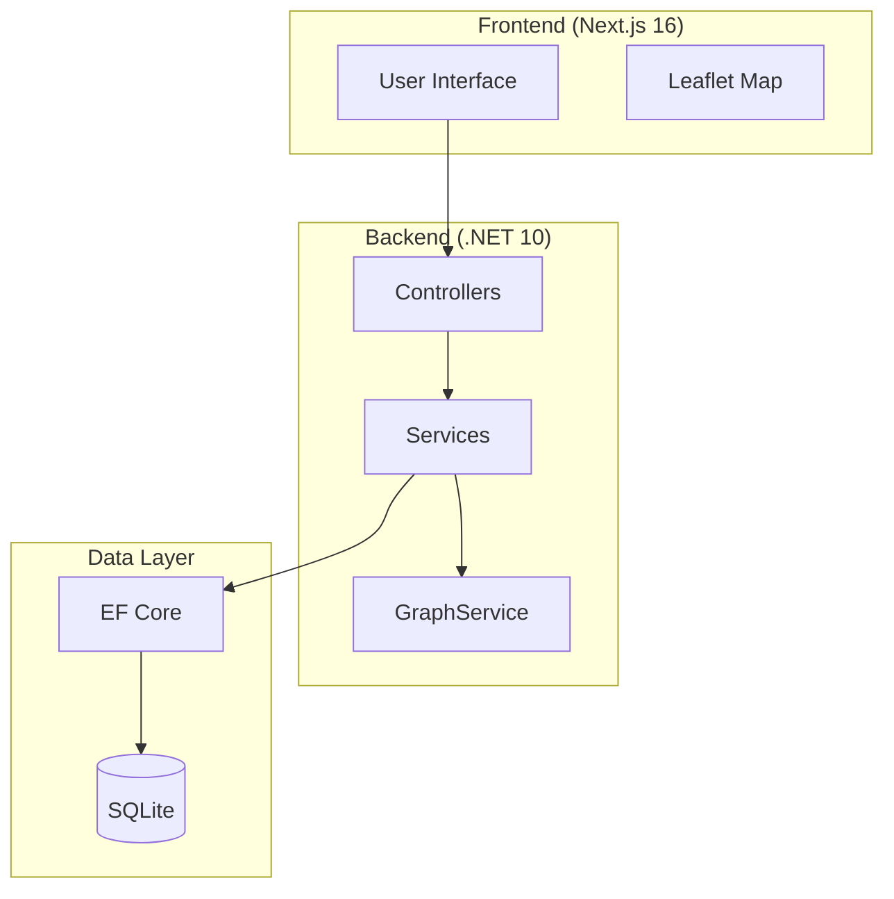

# Diagrams

This folder contains the visual diagrams for the Greater Cairo Transportation Network project, including architecture, data models, API flows, algorithms, and deployment.

## Available Diagrams

### Architecture Diagrams
| File | Description |
|------|-------------|
| `architecture.puml` | System component architecture showing frontend, backend, services, and data layer |
| `deployment.puml` | CI/CD pipeline and production deployment architecture |
| `graph-service-architecture.puml` | GraphService as the foundation for all routing algorithms |

### Data Model Diagrams
| File | Description |
|------|-------------|
| `data-model.puml` | Entity-relationship diagram showing all database tables and relationships |
| `ERD.png` | Exported entity-relationship diagram (PNG) |

### API & Request Flow
| File | Description |
|------|-------------|
| `api-flow.puml` | How HTTP requests flow through controllers, services, and database |
| `algorithm-flow.puml` | Detailed flowchart for Dijkstra algorithm execution |

### Algorithm Diagrams
| File | Description |
|------|-------------|
| `algorithm-map.puml` | How all algorithm modules fit together in the system |
| `ml-prediction.puml` | Machine learning prediction workflow and integration |

## Exporting PlantUML to PNG

These PlantUML files can be converted to PNG images using the PlantUML tool:

```bash
# Windows
plantuml.bat -o ./png architecture.puml

# Or with all diagrams
plantuml.bat -o ./png *.uml
```

The generated PNG files are stored in the `png/` folder.

## Recommended Study Order

1. **Start Here**: Read `architecture.puml` to understand the system structure
2. **Data Layer**: Review `data-model.puml` to see the database schema
3. **Request Flow**: Study `api-flow.puml` to understand how requests are processed
4. **Algorithms**: Examine `algorithm-map.puml` and `algorithm-flow.puml` to see algorithm implementations
5. **ML Integration**: Review `ml-prediction.puml` to understand ML-based traffic predictions
6. **Deployment**: Check `deployment.puml` to see CI/CD pipeline and production setup

## Diagram Preview (Mermaid)

### System Architecture Overview



## Links

- [Project Overview](../PROJECT_OVERVIEW.md)
- [API Reference](../PROJECT_OVERVIEW.md#5-api-reference)
- [Deployment Guide](../DEPLOYMENT.md)
- [Docs Home](../README.md)