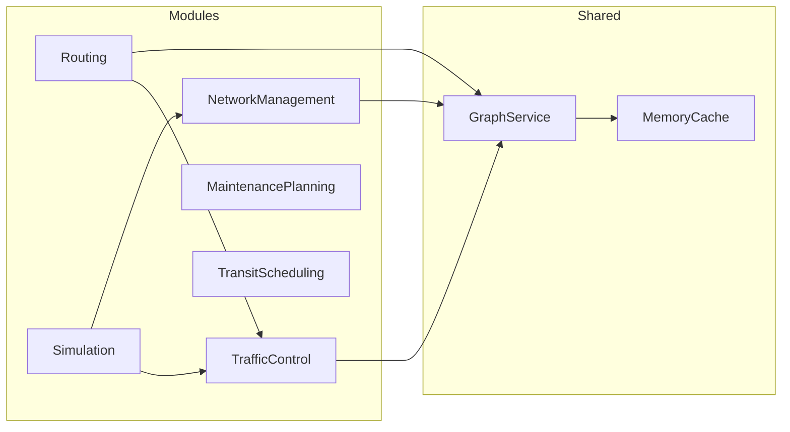
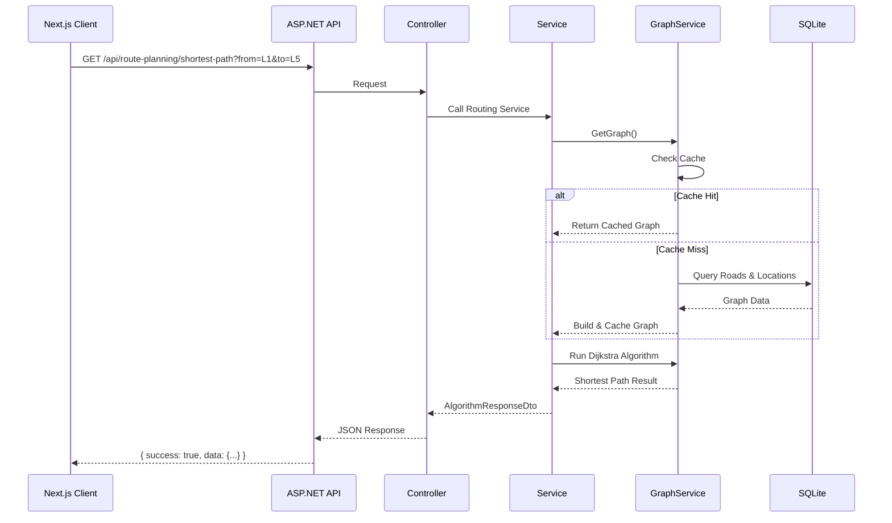
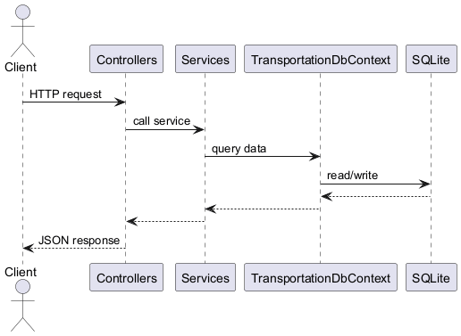
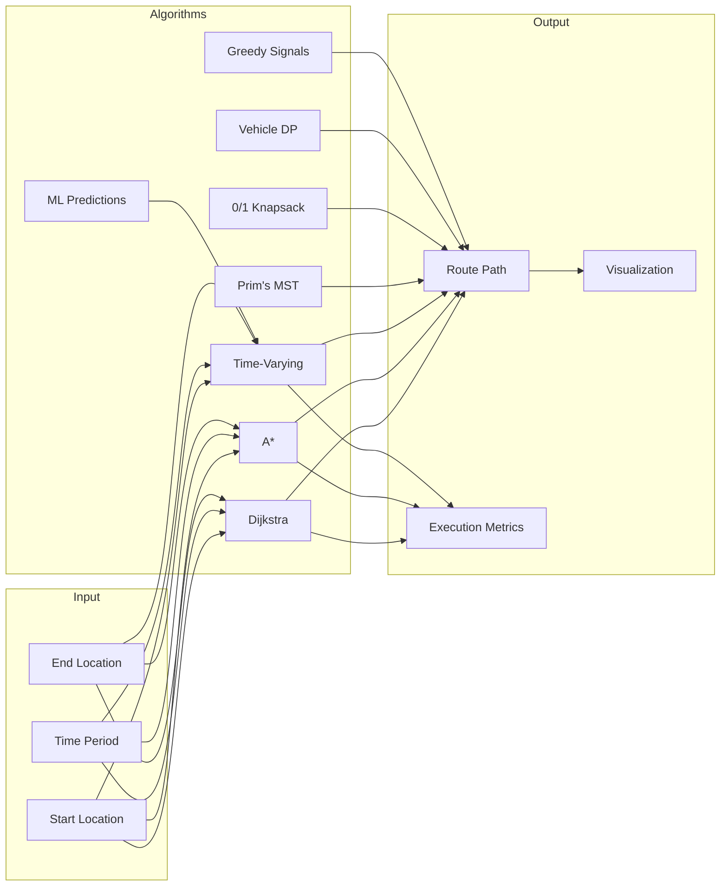

# Greater Cairo Transportation Network – Project Overview

## Table of Contents
1. [Project Purpose](#1-project-purpose)
2. [Repository Layout](#2-repository-layout)
3. [Architecture](#3-architecture)
4. [Data Schemas](#4-data-schemas)
5. [API Reference](#5-api-reference)
6. [Algorithm Implementation Checklist](#6-algorithm-implementation-checklist)
7. [Visual Diagrams](#7-visual-diagrams)
8. [How to Run](#8-how-to-run)
9. [Design Decisions](#9-design-decisions)

---

## 1. Project Purpose

Cairo is one of the world's largest metropolitan areas and faces serious challenges:

- Chronic traffic congestion, especially during morning (07–09) and evening (16–19) rush hours
- A public transit network (metro + buses) that struggles to meet demand
- Ageing road infrastructure with variable quality
- High cost of building new roads, requiring careful cost-benefit analysis

This project implements a **REST API** backed by a **Next.js interactive map** that makes all Cairo transportation data available and runs seven optimisation algorithms:

| # | Algorithm | Category |
|---|-----------|----------|
| 1 | Dijkstra's Shortest Path | Graph Search |
| 2 | A\* Emergency Routing | Heuristic Search |
| 3 | Time-Varying Dijkstra | Traffic-Aware Routing |
| 4 | Prim's MST (network design) | Minimum Spanning Tree |
| 5 | 0/1 Knapsack DP (road maintenance) | Dynamic Programming |
| 6 | Vehicle Allocation DP (transit scheduling) | Dynamic Programming |
| 7 | Greedy Traffic Signal Timing | Greedy Algorithm |
| 8 | ML Predictions (Gradient Boosting) | Machine Learning |

---

## 2. Repository Layout

```
Greater-Cairo-Transportation-Network/
├── PROJECT_REQUIREMENTS.md   ← course brief
├── PROJECT_OVERVIEW.md       ← this file
├── REPORT.md                 ← comprehensive technical report (PDF-ready)
├── README.md                 ← quick-start instructions
├── Docs/
│   ├── CSE112-Practical Project.txt   ← original project brief
│   └── Project_Provided_Data.txt      ← raw data reference
└── Apps/
    ├── Server/CairoTransportation/    ← .NET 10 REST API
    │   ├── CairoTransportation.csproj
    │   ├── Program.cs                 ← entry point + DI composition
    │   ├── appsettings.json
    │   ├── Data/
    │   │   ├── TransportationDbContext.cs
    │   │   ├── DatabaseSeeder.cs
    │   │   └── TablesData.sql         ← full Cairo seed dataset
    │   ├── Migrations/                ← EF Core migrations
    │   ├── Modules/
    │   │   ├── NetworkManagement/     ← Locations + Roads CRUD
    │   │   │   ├── Controllers/       (LocationsController, RoadsController, GraphController)
    │   │   │   ├── Models/            (Location, Road)
    │   │   │   └── Services/          (LocationService, RoadService)
    │   │   ├── Routing/               ← Dijkstra, A*, Time-Varying, MST
    │   │   │   ├── Controllers/       (AlgorithmsController, AStarController, MstController, RoutesController)
    │   │   │   ├── Models/            (TransportRoute, RouteStop)
    │   │   │   └── Services/
    │   │   │       ├── Strategies/Dijkstra/      DijkstraService ✅
    │   │   │       ├── Strategies/AStar/         AStarService ✅
    │   │   │       └── Strategies/TimeVaryingDijkstra/ TimeVaryingDijkstraService ✅
    │   │   ├── TrafficControl/        ← Traffic data + Greedy signal timing
    │   │   │   ├── Controllers/       (TrafficController, TrafficSignalController, ...)
    │   │   │   ├── Models/            (TrafficFlow, TrafficPeriodMultiplier)
    │   │   │   └── Services/          (TrafficService, TrafficSignalService ✅)
    │   │   ├── MaintenancePlanning/   ← 0/1 Knapsack DP
    │   │   │   ├── Controllers/       (MaintenancePlanningController)
    │   │   │   ├── Models/            (RoadMaintenance)
    │   │   │   └── Services/          (MaintenancePlanningService ✅)
    │   │   └── TransitScheduling/     ← Vehicle Allocation DP
    │   │       ├── Controllers/       (TransitSchedulingController)
    │   │       ├── Models/            (TransportDemand)
    │   │       └── Services/          (TransitSchedulingService ✅)
    │   └── Utils/
    │       ├── Helpers/Graph/         ← GraphService (shared, cached with IMemoryCache)
    │       ├── Helpers/Mst/           ← MstService (Prim's algorithm ✅)
    │       ├── Helpers/Common/        ← AlgorithmResponseDto, AlgorithmTraceDto, Metrics
    │       └── Extensions/            ← DI registration helpers
    │
    └── client/                        ← Next.js 16 frontend
        ├── src/
        │   ├── app/page.tsx           ← server component (fetches network topology)
        │   ├── components/MapView.tsx ← interactive Leaflet map (1400+ lines)
        │   ├── services/              ← typed API client functions
        │   ├── types/index.ts         ← shared TypeScript types
        │   └── utils/
        └── tests/                     ← Jest unit tests (17 tests)
```

---

## 3. Architecture

### 3.1 Technology Stack

| Layer | Technology | Version |
|-------|-----------|---------|
| Backend API | ASP.NET Core | .NET 10 |
| ORM | Entity Framework Core | 9.x |
| Database | SQLite | 3.x |
| Frontend | Next.js + React | 16 + 19 |
| Language (client) | TypeScript | 5.x |
| Styling | Tailwind CSS | v4 |
| Map | React-Leaflet | 4.x |
| Testing (client) | Jest | 29.x |


**Figure 3.1:** System Architecture - Shows the relationship between Frontend, Backend, Services, and Data Layer

### 3.2 Modular Monolith Architecture

```mermaid
flowchart TB
    subgraph Client["Frontend - Next.js 16"]
        UI[User Interface]
        MAP[Leaflet Map]
        API[API Client]
    end

    subgraph Backend["Backend - .NET 10"]
        subgraph API["API Layer"]
            CTRL[Controllers]
        end
        
        subgraph Services["Business Logic"]
            ROUTING[Routing Services]
            TRAFFIC[Traffic Services]
            MAINT[Maintenance Services]
            TRANSIT[Transit Services]
            NETWORK[Network Services]
            ML[ML Predictions]
        end
        
        subgraph Shared["Shared Infrastructure"]
            GRAPH[GraphService]
            CACHE[IMemoryCache]
        end
        
        subgraph Data["Data Layer"]
            EF[Entity Framework Core]
            DB[(SQLite Database)]
            SEED[Database Seeder]
        end
    end

    Client -->|HTTP/REST| Backend
    CTRL --> ROUTING & TRAFFIC & MAINT & TRANSIT & NETWORK & ML
    ROUTING & TRAFFIC & MAINT & TRANSIT & NETWORK --> GRAPH
    GRAPH --> CACHE
    all Services --> EF
    EF --> DB
    EF --> SEED
```

### 3.3 Service Module Dependency Graph



### 3.4 Request Flow Diagram





**Figure 3.4:** API Request Flow - Visual representation of HTTP request processing through the system

### 3.3 Response Envelope

Every algorithm endpoint returns an `AlgorithmResponseDto<T>`:

```json
{
  "algorithmName": "string",
  "success": true,
  "message": "string",
  "trace": {
    "visitedNodes": 22,
    "expandedNodes": 18,
    "executionTimeMs": 1
  },
  "data": { ... }
}
```

---

## 4. Data Schemas

All data lives in a single **SQLite** file, auto-created and seeded at startup from `Data/TablesData.sql`.


**Figure 4.1:** Database ERD - All entities and their relationships

### 4.1 locations

| Column | Type | Description |
|--------|------|-------------|
| `id` | TEXT PK | Node identifier (numeric for neighbourhoods, "F…" for facilities) |
| `name` | TEXT | Human-readable location name |
| `type` | TEXT | `NEIGHBORHOOD` or `FACILITY` |
| `category` | TEXT | Sub-category (e.g., "Residential", "Medical", "Airport") |
| `population` | INT | Resident/daily population |
| `x` | REAL | Longitude (WGS-84, ~31) |
| `y` | REAL | Latitude (WGS-84, ~30) |
| `is_critical` | INT | 1 = critical facility (hospital, airport, etc.) |

### 4.2 roads

| Column | Type | Description |
|--------|------|-------------|
| `id` | INT PK | Auto-generated road ID |
| `from_location_id` | TEXT FK | Source location |
| `to_location_id` | TEXT FK | Destination location |
| `distance` | REAL | Length in km (> 0 constraint) |
| `capacity` | INT | Max flow in vehicles/hour (> 0 constraint) |
| `condition` | INT | Quality 1–10 (NULL for potential roads) |
| `is_existing` | INT | 1 = existing road; 0 = potential |
| `is_two_way` | INT | 1 = bidirectional |
| `construction_cost` | REAL | Cost in million EGP (NULL for existing) |

### 4.3 traffic_period_multipliers

| Column | Type | Description |
|--------|------|-------------|
| `period` | TEXT PK | `MORNING`, `EVENING`, `NIGHT` |
| `multiplier` | REAL | Speed factor (MORNING: 1.15, EVENING: 1.25, NIGHT: 0.90) |

### 4.4 traffic_flow

| Column | Type | Description |
|--------|------|-------------|
| `id` | INT PK | Auto-generated |
| `road_id` | INT FK | → roads.id |
| `period` | TEXT FK | → traffic_period_multipliers.period |
| `flow` | INT | Observed vehicles/hour (unique constraint on road_id + period) |

### 4.5 transport_routes

| Column | Type | Description |
|--------|------|-------------|
| `id` | TEXT PK | Route code (M1–M4 metro, B1–B4 bus) |
| `type` | TEXT | `METRO` or `BUS` |
| `daily_passengers` | INT | Total daily ridership |
| `vehicles_assigned` | INT | Current fleet size (NULL = DP-managed) |
| `capacity_per_unit` | INT | Passengers per vehicle (default 50) |

### 4.6 route_stops

| Column | Type | Description |
|--------|------|-------------|
| `route_id` | TEXT FK | → transport_routes.id |
| `location_id` | TEXT FK | → locations.id |
| `stop_order` | INT | Stop sequence number |

### 4.7 road_maintenance

| Column | Type | Description |
|--------|------|-------------|
| `road_id` | INT PK/FK | → roads.id (one-to-one) |
| `priority` | INT | Urgency 1–10 |
| `estimated_cost` | REAL | Repair cost in million EGP |

### 4.8 transport_demand

| Column | Type | Description |
|--------|------|-------------|
| `id` | INT PK | Auto-generated |
| `from_location_id` | TEXT FK | Origin |
| `to_location_id` | TEXT FK | Destination |
| `daily_passengers` | INT | Daily demand on this OD pair |

---

## 5. API Reference

### Routing

| Method | URL | Query params | Description |
|--------|-----|-------------|-------------|
| GET | `/api/route-planning/shortest-path` | `from`, `to` | Dijkstra shortest path |
| GET | `/api/route-planning/time-route` | `from`, `to`, `period` | Traffic-aware route |
| GET | `/api/emergency-routing` | `from`, `to` | A\* emergency route |

### Network Design

| Method | URL | Query params | Description |
|--------|-----|-------------|-------------|
| GET | `/api/network-expansion` | _(none)_ | Prim's MST cheapest network |
| GET | `/api/network-topology` | _(none)_ | Full graph for map rendering |

### Maintenance Planning

| Method | URL | Query params | Description |
|--------|-----|-------------|-------------|
| GET | `/api/maintenance-planning` | `budget` | 0/1 Knapsack DP maintenance plan |

### Transit Scheduling

| Method | URL | Query params | Description |
|--------|-----|-------------|-------------|
| GET | `/api/transit-scheduling` | `totalVehicles` | Vehicle allocation DP |

### Traffic Signal Optimisation

| Method | URL | Query params | Description |
|--------|-----|-------------|-------------|
| GET | `/api/traffic-signals` | `period`, `topN`, `analyzeAllIntersections` | Greedy signal timing |

### Data Access

| Method | URL | Description |
|--------|-----|-------------|
| GET | `/api/locations` | All 35 locations |
| GET | `/api/locations/{id}` | Single location |
| GET | `/api/roads` | All 74 roads |
| GET | `/api/roads/{id}` | Single road |
| GET | `/api/roads/from/{locationId}` | Roads from a location |
| GET | `/api/roads/{roadId}/maintenance` | Maintenance info for a road |
| GET | `/api/traffic/road/{roadId}` | Traffic flows for a road |
| GET | `/api/traffic/period/{period}` | All traffic flows for a period |
| GET | `/api/routes` | All 8 transport routes |
| GET | `/api/routes/{id}` | Single route |
| GET | `/api/routes/{id}/stops` | Stops for a route |

---

## 6. Algorithm Implementation Checklist

> ✅ = fully implemented  
> ⬜ = not yet implemented

### 6.1 Shortest Path Algorithms

| # | Algorithm | Endpoint | Status |
|---|-----------|----------|--------|
| 1 | **Dijkstra's Shortest Path** | `GET /api/route-planning/shortest-path` | ✅ Implemented |
| 2 | **A\* Emergency Routing** | `GET /api/emergency-routing` | ✅ Implemented |
| 3 | **Time-Varying Dijkstra** | `GET /api/route-planning/time-route` | ✅ Implemented |

### 6.2 Minimum Spanning Tree Algorithms

| # | Algorithm | Endpoint | Status |
|---|-----------|----------|--------|
| 4 | **Prim's MST** (all roads) | `GET /api/network-expansion` | ✅ Implemented |

### 6.3 Dynamic Programming

| # | Algorithm | Endpoint | Status |
|---|-----------|----------|--------|
| 5 | **DP Road Maintenance** (0/1 Knapsack) | `GET /api/maintenance-planning` | ✅ Implemented |
| 6 | **DP Vehicle Allocation** (Transit Scheduling) | `GET /api/transit-scheduling` | ✅ Implemented |
| 7 | **Memoization** (Graph caching) | via `IMemoryCache` in `GraphService` | ✅ Implemented |

### 6.4 Greedy Algorithms

| # | Algorithm | Endpoint | Status |
|---|-----------|----------|--------|
| 8 | **Greedy Traffic Signal Timing** | `GET /api/traffic-signals` | ✅ Implemented |

### 6.5 Machine Learning

| # | Algorithm | Endpoint | Status |
|---|-----------|----------|--------|
| 9 | **ML Traffic Predictions** (Gradient Boosting) | `GET /api/ml-predictions` | ✅ Implemented |


**Figure 6.5:** ML Traffic Prediction - Shows how traffic congestion predictions are generated and integrated with Time-Varying Dijkstra routing

### 6.6 Algorithm Flow Diagrams



---

## 7. Visual Diagrams

The following diagrams provide visual representations of the system's architecture, data model, algorithms, and deployment:

| Diagram | File | Description |
|---------|------|-------------|
| System Architecture | [PlantUMLout/Architecture - Component Diagram.png](DIAGRAMS/PlantUMLout/Architecture%20-%20Component%20Diagram.png) | High-level component architecture showing frontend, backend, services, and data layer |
| Deployment Pipeline | [PlantUMLout/Deployment Diagram - CI-CD Pipeline.png](DIAGRAMS/PlantUMLout/Deployment%20Diagram%20-%20CI-CD%20Pipeline.png) | CI/CD pipeline from GitHub to VPS with Docker and Cloudflare |
| Data Model (ERD) | [PlantUMLout/Data Model - Entity Relationship Diagram.png](DIAGRAMS/PlantUMLout/Data%20Model%20-%20Entity%20Relationship%20Diagram.png) | Database schema with all entities and relationships |
| Algorithm Map | [PlantUMLout/algorithm-map.png](DIAGRAMS/PlantUMLout/algorithm-map.png) | How algorithm modules fit together |
| Graph Service | [PlantUMLout/graph-service-architecture.png](DIAGRAMS/PlantUMLout/graph-service-architecture.png) | Shared graph infrastructure dependencies |
| Algorithm Flow | [PlantUMLout/Algorithm Flowchart - Dijkstra Example.png](DIAGRAMS/PlantUMLout/Algorithm%20Flowchart%20-%20Dijkstra%20Example.png) | Dijkstra algorithm execution steps |
| API Flow | [PlantUMLout/api-flow.png](DIAGRAMS/PlantUMLout/api-flow.png) | HTTP request processing through the system |
| ML Predictions | [PlantUMLout/ML Predictions Workflow.png](DIAGRAMS/PlantUMLout/ML%20Predictions%20Workflow.png) | Machine learning prediction workflow |

---

## 8. How to Run

### Prerequisites

- [.NET 10 SDK](https://dotnet.microsoft.com/download/dotnet/10.0)
- [Node.js 20+](https://nodejs.org/) + npm

### 8.1 Start the API server

```bash
cd Apps/Server/CairoTransportation
dotnet run
```

The API starts on `http://localhost:5028`. Swagger UI is available at `http://localhost:5028/swagger` in development mode.

The database is created automatically, migrations are applied, and seed data is inserted on first run.

### 8.2 Start the frontend

```bash
cd Apps/client
npm install
npm run dev
```

Open `http://localhost:3000` in your browser to view the interactive Cairo map.

### 8.3 Run client tests

```bash
cd Apps/client
npm test
```

---

## 9. Design Decisions

### 8.1 .NET 10 / ASP.NET Core instead of Spring Boot

The server was migrated from a Spring Boot / Java prototype to **.NET 10 / ASP.NET Core** to leverage:
- **Faster startup** (no JVM warm-up)
- **Simpler DI** with `AddScoped`, `AddSingleton`
- **EF Core** as a lightweight alternative to Hibernate
- **SQLite** for zero-configuration local development

### 8.2 SQLite for persistence

SQLite was chosen because:
- Zero configuration – the database file is created automatically
- Portable – the file can be committed for demos or deleted for a fresh start
- EF Core migrations keep the schema in sync with the code

### 8.3 Modular Monolith

The codebase is organised by domain module rather than technical layer. Each module (`NetworkManagement`, `Routing`, `TrafficControl`, etc.) owns its own controllers, models, and services. Shared infrastructure (`GraphService`, DTOs, metrics) lives in `Utils/`.

This makes it easy to:
- Locate all code related to a feature in one folder
- Avoid cross-module coupling (controllers never reach into another module's internals)
- Evolve individual modules independently

### 8.4 Shared Graph with Memoization

All routing and MST algorithms use the same `IGraphService`, which builds a directed adjacency-list graph from the database. The graph is cached in `IMemoryCache` with a 30-second TTL to avoid redundant database queries when multiple algorithm endpoints are called in quick succession (e.g., when the frontend loads MST data on startup).

### 8.5 Standardised Algorithm Response

Every algorithm returns `AlgorithmResponseDto<T>` containing:
- `algorithmName` – identifies which algorithm was executed
- `success` / `message` – clear error reporting
- `trace` – execution metrics (nodes visited/expanded, time in ms) for educational comparison
- `data` – the algorithm-specific result payload

This makes it easy for the frontend to display consistent result panels and for students to compare algorithm performance.

### 8.6 Coordinate Convention

Node coordinates follow:
- `x` = **longitude** (~31 for Cairo)
- `y` = **latitude** (~30 for Cairo)

React-Leaflet uses `[lat, lng]` = `[node.y, node.x]` for marker and polyline positions.
