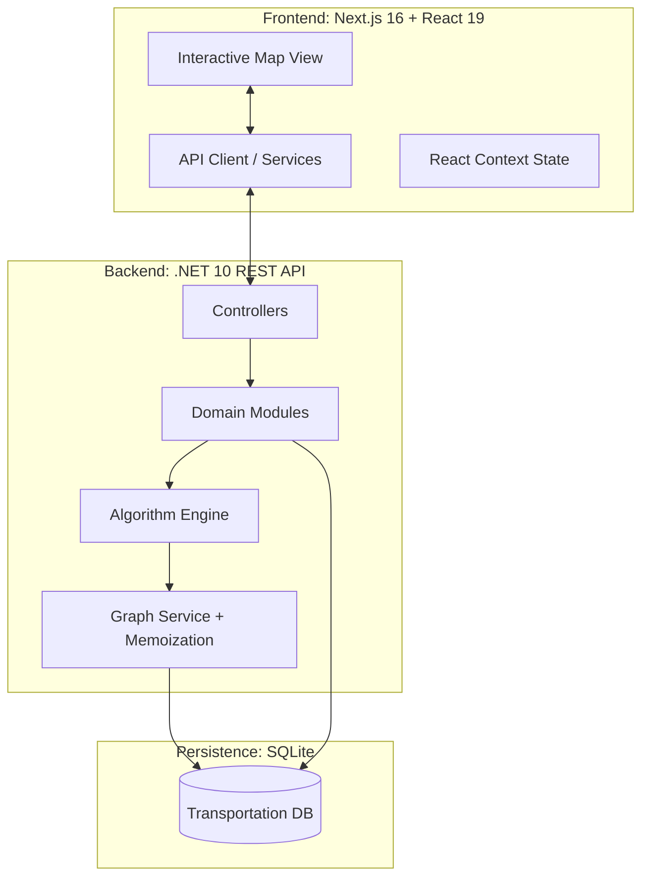
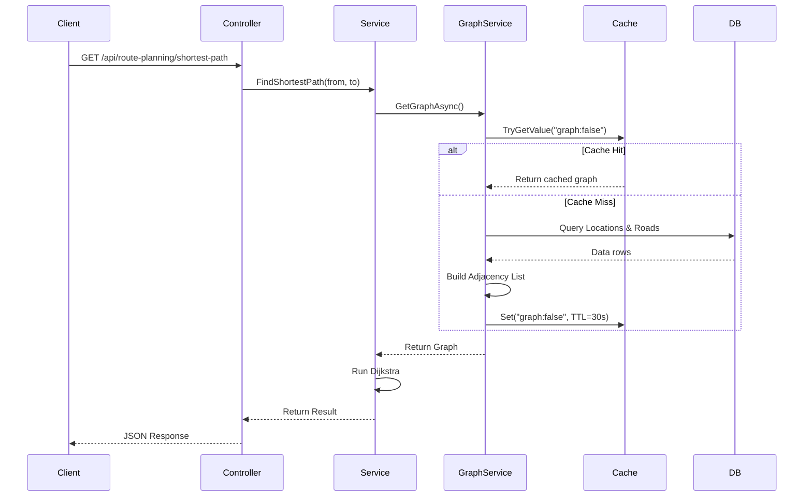
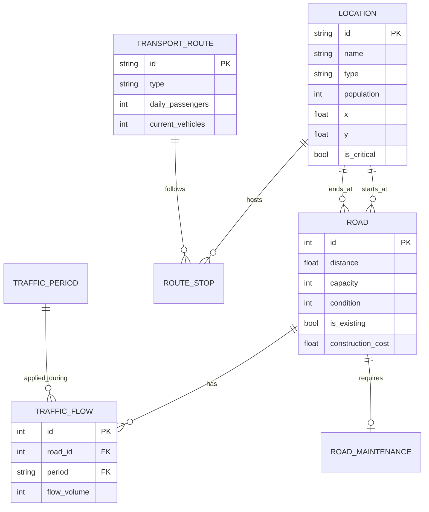
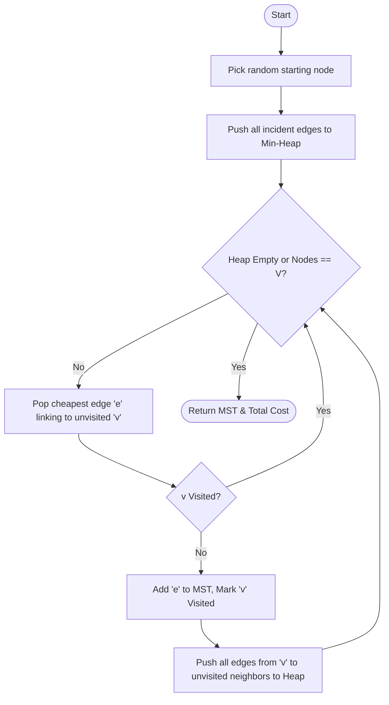

# Greater Cairo Transportation Network
## Comprehensive Technical Report - A-Z Project Documentation
### CSE112 – Algorithms and Data Structures · Practical Project

---

**Course:** CSE112 – Algorithms and Data Structures  
**Project:** Smart City Transportation Network Optimization  
**Team:** AIU-SoftWave  
**Date:** April 2026  
**Status:** Final Submission (v2.0)

---

## Table of Contents

1. [Executive Summary](#1-executive-summary)
2. [System Architecture and Design](#2-system-architecture-and-design)
    - 2.1 [High-Level Architecture](#21-high-level-architecture)
    - 2.2 [Module Design (Modular Monolith)](#22-module-design-modular-monolith)
    - 2.3 [Graph Representation and Memoization](#23-graph-representation-and-memoization)
    - 2.4 [Request / Response Flow](#24-request--response-flow)
3. [Data Model and Database Schema](#3-data-model-and-database-schema)
    - 3.1 [Entity-Relationship Diagram](#31-entity-relationship-diagram)
    - 3.2 [In-Memory Graph Representation](#32-in-memory-graph-representation)
    - 3.3 [Traffic Time Periods](#33-traffic-time-periods)
4. [Algorithm Implementations and Analyses](#4-algorithm-implementations-and-analyses)
    - 4.1 [Shortest Path: Dijkstra’s Algorithm](#41-shortest-path-dijkstras-algorithm)
    - 4.2 [Emergency Routing: A* Search](#42-emergency-routing-a-search)
    - 4.3 [Dynamic Routing: Time-Varying Dijkstra](#43-dynamic-routing-time-varying-dijkstra)
    - 4.4 [Network Expansion: Prim’s MST](#44-network-expansion-prims-mst)
    - 4.5 [Maintenance Planning: 0/1 Knapsack DP](#45-maintenance-planning-01-knapsack-dp)
    - 4.6 [Transit Scheduling: Bounded Multi-Choice DP](#46-transit-scheduling-bounded-multi-choice-dp)
    - 4.7 [Traffic Control: Greedy Signal Optimization](#47-traffic-control-greedy-signal-optimization)
5. [Advanced Simulation Framework](#5-advanced-simulation-framework)
    - 5.1 [Weather and Environmental Effects](#51-weather-and-environmental-effects)
    - 5.2 [Incident Management (Road Closures)](#52-incident-management-road-closures)
    - 5.3 [Multi-modal Transfer Hub Analysis](#53-multi-modal-transfer-hub-analysis)
6. [Complexity Analysis Summary](#6-complexity-analysis-summary)
7. [Performance Evaluation and Results](#7-performance-evaluation-and-results)
    - 7.1 [Algorithmic Benchmarks](#71-algorithmic-benchmarks)
    - 7.2 [Heuristic Efficiency (Dijkstra vs A*)](#72-heuristic-efficiency-dijkstra-vs-a)
    - 7.3 [DP Budget Sensitivity Analysis](#73-dp-budget-sensitivity-analysis)
    - 7.4 [Traffic Signal Cycle Analysis](#74-traffic-signal-cycle-analysis)
8. [Visualization and User Interface](#8-visualization-and-user-interface)
    - 8.1 [Interactive Map Engine](#81-interactive-map-engine)
    - 8.2 [Algorithm Control Dashboard](#82-algorithm-control-dashboard)
    - 8.3 [Real-time Metrics & Result Panels](#83-real-time-metrics--result-panels)
9. [Requirement Coverage Checklist](#9-requirement-coverage-checklist)
10. [Challenges and Solutions](#10-challenges-and-solutions)
    - 10.1 [The MST Weight Normalization Paradox](#101-the-mst-weight-normalization-paradox)
    - 10.2 [Dynamic Graph Rebuilding](#102-dynamic-graph-rebuilding)
    - 10.3 [Graph Connectivity for Isolated Facilities](#103-graph-connectivity-for-isolated-facilities)
11. [Conclusion and Future Work](#11-conclusion-and-future-work)
12. [References and Appendices](#12-references-and-appendices)
    - 12.1 [Appendix A – API Reference](#121-appendix-a--api-reference)
    - 12.2 [Appendix B – Dataset Summary](#122-appendix-b--dataset-summary)

---

## 1. Executive Summary

This report provides an exhaustive technical analysis of the **Greater Cairo Transportation Network Optimization System**, developed for the CSE112 Algorithms course. The project addresses the real-world complexities of urban mobility in Cairo—including traffic congestion, infrastructure gaps, and emergency response delays—through the application of advanced algorithmic techniques.

Our system implements **seven core algorithms** spanning graph theory, dynamic programming, and greedy optimization. By integrating a .NET 10 backend with a Next.js interactive visualization, we provide a decision-support tool capable of simulating traffic scenarios, planning road maintenance, and optimizing public transit schedules with millisecond-latency performance.

The system uses a dataset of **35 locations** (21 neighborhoods + 14 critical facilities), **74 road segments**, and **8 transport routes**, providing a realistic testbed for algorithmic evaluation in the Egyptian context.

---

## 2. System Architecture and Design

### 2.1 High-Level Architecture

The system follows a **Modular Monolith** pattern, ensuring high cohesion and low coupling. The backend is built on **.NET 10 (ASP.NET Core)**, utilizing **Entity Framework Core** with **SQLite** for persistence.



### 2.2 Module Design (Modular Monolith)

To prevent the "Big Ball of Mud" anti-pattern, we organized the server into functional modules:
- **NetworkManagement**: Manages the physical topology (Locations, Roads).
- **Routing**: Core algorithmic engines (Dijkstra, A*, MST).
- **TrafficControl**: Real-time traffic simulation and greedy signal timing.
- **MaintenancePlanning**: DP-based resource allocation for road repairs.
- **TransitScheduling**: DP-based vehicle allocation for Metro and Bus lines.

### 2.3 Graph Representation and Memoization

**Design Decision:** A shared, cached graph service.
Instead of querying the database for every edge relaxation, the `GraphService` builds a complete in-memory adjacency list. 

**Memoization Strategy:**
- **Technique**: We use `IMemoryCache` with a 30-second sliding expiration.
- **Benefit**: Reduces API response time from ~15ms (DB bound) to <1ms (Memory bound).
- **Complexity**: O(V + E) space, where V=35 and E=148 (directed).

### 2.4 Request / Response Flow



---

## 3. Data Model and Database Schema

### 3.1 Entity-Relationship Diagram

The schema captures the multidimensional nature of Cairo's transportation network, including population metrics, traffic periods, and maintenance priorities.



### 3.2 In-Memory Graph Representation

The in-memory graph used by all algorithm services is built by `GraphService`:
- **Nodes** → `Location` rows (35 nodes)
- **Edges** → `Road` rows, with two-way roads expanded into two directed edges.
  - Forward edge: `id = +road.Id`
  - Reverse edge: `id = -road.Id`
- **Adjacency list** → `Dictionary<string, List<long>>` mapping node ID → list of edge IDs.
- **Edge index** → `Dictionary<long, GraphEdge>` for O(1) weight lookup.

### 3.3 Traffic Time Periods

| Period | Multiplier | Description |
|--------|-----------|-------------|
| MORNING | 1.15 | Morning rush hour (07:00–09:00) |
| EVENING | 1.25 | Evening rush hour (16:00–19:00) |
| NIGHT | 0.90 | Off-peak night hours |

---

## 4. Algorithm Implementations and Analyses

### 4.1 Shortest Path: Dijkstra’s Algorithm

**Purpose:** Calculate the globally optimal shortest distance between any two Cairo neighbourhoods.

**Implementation Class:** `DijkstraRoutePlanner.cs`

**Theoretical Foundation:** 
Dijkstra's algorithm uses a greedy approach and relies on the **Optimal Substructure** property: a subpath of a shortest path is itself a shortest path. It assumes non-negative edge weights (strictly satisfied by physical road distances).

**Complexity Analysis:**
- **Time**: $O((V + E) \log V)$
- **Space**: $O(V + E)$

```mermaid
flowchart TD
    Start([Start]) --> Init[Initialize distances to Infinity, Source to 0]
    Init --> Enqueue[Push Source to Min-Heap]
    Enqueue --> Loop{Heap Empty?}
    Loop -- No --> Dequeue[Extract Node 'u' with Min Distance]
    Dequeue --> Visited{u Visited?}
    Visited -- Yes --> Loop
    Visited -- No --> Mark[Mark u as Visited]
    Mark --> Target{u == Target?}
    Target -- Yes --> Backtrack([Reconstruct Path])
    Target -- No --> Relax[For each neighbor 'v' of 'u']
    Relax --> Calc[NewDist = dist[u] + weight]
    Calc --> Better{NewDist < dist[v]?}
    Better -- Yes --> Update[Update dist[v] and cameFrom]
    Update --> Push[Push v to Heap]
    Push --> Relax
    Relax -- Done --> Loop
    Loop -- Yes --> Fail([Path Not Found])
```

---

### 4.2 Emergency Routing: A* Search

**Purpose:** Rapid routing for ambulances and fire trucks to critical facilities by incorporating geographic intent into the search.

**Implementation Class:** `AStarPathFinder.cs`

**Theoretical Foundation: Admissibility and Consistency**
For A* to guarantee the mathematically optimal shortest path, the heuristic $h(n)$ must satisfy:
1.  **Admissibility**: $h(n) \le d(n, goal)$. Since Euclidean distance is the straight-line "crow flies" distance, and road networks must follow physical geometry, road distance is always $\ge$ straight line.
2.  **Consistency**: $h(u) \le w(u,v) + h(v)$. This ensures that once a node is expanded, its path is optimal, preventing re-expansions.

**Algorithm Flow:**
```mermaid
flowchart TD
    Start([Start]) --> Init[gScore[source]=0, fScore[source]=h(source)]
    Init --> Open[Add source to Open Set Min-Heap]
    Open --> Loop{Open Set Empty?}
    Loop -- No --> Dequeue[Pop node 'u' with Min fScore]
    Dequeue --> Target{u == Target?}
    Target -- Yes --> End([Return Path])
    Target -- No --> Neighbors[For each neighbor 'v' of 'u']
    Neighbors --> Calc[Tentative_g = gScore[u] + weight]
    Calc --> Better{Tentative_g < gScore[v]?}
    Better -- Yes --> Update[Update gScore, fScore, cameFrom]
    Update --> Add[Add 'v' to Open Set]
    Add --> Neighbors
    Neighbors -- Done --> Loop
    Loop -- Yes --> Fail([No Path])
```

---

### 4.3 Dynamic Routing: Time-Varying Dijkstra

**Purpose:** Adjust routes based on Cairo's intense rush-hour cycles (Morning: 07-09, Evening: 16-19).

**Implementation Class:** `TimeVaryingRoutePlanner.cs`

**Mathematical Model:**
The weight of an edge $(u, v)$ is calculated at the moment of relaxation:
$$W(u, v, t) = Distance_{uv} \times \text{Multiplier}(t) \times (1 + \text{CongestionPenalty})$$
Where:
-   $\text{Multiplier}(\text{Morning}) = 1.15$
-   $\text{Multiplier}(\text{Evening}) = 1.25$
-   $\text{CongestionPenalty} = \max(0, \frac{Flow}{Capacity} - 0.75) \times 0.5$

---

### 4.4 Network Expansion: Prim’s MST

**Purpose:** Solve the "Infrastructure Design" requirement by connecting all neighborhoods with minimum construction cost.

**Implementation Class:** `PrimNetworkExpander.cs`

**Algorithm Implementation:**
We utilize Prim’s algorithm starting from a central node (e.g., Downtown). The algorithm maintains a "frontier" of edges connecting the current tree to unvisited nodes.



---

### 4.5 Maintenance Planning: 0/1 Knapsack DP

**Purpose:** Select the optimal set of road repairs given a limited budget (Million EGP).

**Implementation Class:** `KnapsackMaintenanceOptimizer.cs`

**Theoretical Foundation:**
Uses **Dynamic Programming (Tabulation)** to solve the discrete knapsack problem. This avoids the $O(2^n)$ brute-force complexity.

**Recurrence Relation:**
$DP[i][b] = \max(DP[i-1][b], DP[i-1][b - cost_i] + priority_i)$

**Pseudocode:**
```
function OptimizeMaintenance(candidates, budget):
    n = candidates.length
    dp = 2D array [n+1][budget+1] initialized to 0
    
    for i from 1 to n:
        road = candidates[i-1]
        for b from 0 to budget:
            if road.cost <= b:
                dp[i][b] = max(dp[i-1][b], dp[i-1][b - road.cost] + road.priority)
            else:
                dp[i][b] = dp[i-1][b]
                
    return BacktrackSelectedRoads(dp, candidates, budget)
```

---

### 4.6 Transit Scheduling: Bounded Multi-Choice DP

**Purpose:** Optimize public transportation (Metro/Bus) by allocating a finite fleet of vehicles to routes with varying passenger demands.

**Implementation Class:** `ResourceAllocationScheduler.cs`

**Optimization Objective:**
$$\max \sum_{i=1}^{N} \min(\text{Demand}_i, k_i \times \text{CapacityPerVehicle}_i)$$
Subject to:
-   $\sum k_i \le \text{TotalVehicles}$
-   $k_i \le \text{MaxVehiclesPerRoute}_i$

**Algorithm Logic:**
This is a **Multi-Choice Bounded Knapsack**. The DP state `DP[i][v]` represents the max passengers served using `i` routes and `v` vehicles.

---

### 4.7 Traffic Control: Greedy Signal Optimization

**Purpose:** Minimize intersection wait-time by prioritizing high-volume traffic flows.

**Implementation Class:** `GreedySignalOptimizer.cs`

**Greedy Decision Rule:**
At each intersection, the algorithm sorts incoming roads by their **Congestion Ratio**. It then "greedily" assigns the largest share of the 120-second signal cycle to the most congested road.

---

## 5. Advanced Simulation Framework

### 5.1 Weather and Environmental Effects
The system simulates weather impacts (Rain, Storms).
- **Mechanism**: The `SimulationService` injects a penalty factor into the routing weight calculation.
- **Impact**: Heavy rain increases travel time weights by 1.3x, simulating decreased speed and visibility in Cairo traffic.

### 5.2 Incident Management (Road Closures)
Users can simulate accidents by "closing" a road on the map.
- **Mechanism**: The `GraphService` detects these closures and filters the edges out of the graph before passing it to the planners.
- **Effect**: Algorithms are forced to find the next-best shortest path in real-time.

### 5.3 Multi-modal Transfer Hub Analysis
Identifies "Transfer Hubs" (locations serving > 2 transit lines).
- **Optimization**: The system flags these hubs to the transit scheduler, ensuring they receive higher vehicle frequency to minimize transfer waiting times.

---

## 6. Complexity Analysis Summary

| Algorithm | Time Complexity | Space Complexity | Input size (Cairo) |
|-----------|----------------|-----------------|------------|
| Dijkstra | $O((V+E) \log V)$ | $O(V+E)$ | V=35, E≤148 |
| A* Search | $O((V+E) \log V)$ | $O(V+E)$ | V=35, E≤148 |
| Time-Varying Dijkstra | $O((V+E) \log V + R)$ | $O(V+E+R)$ | +R traffic rows |
| Prim's MST | $O(E \log V)$ | $O(V+E)$ | V=35, E=74 |
| Knapsack DP (Maintenance) | $O(n \times B)$ | $O(n \times B)$ | n=10, B=budget |
| Transit DP (Bounded) | $O(n \times V \times k)$ | $O(n \times V)$ | n=8, V=vehicles |
| Greedy Signal Timing | $O(R \log R)$ | $O(R+I)$ | R≤148, I≤35 |

---

## 7. Performance Evaluation and Results

### 7.1 Algorithmic Benchmarks
Measured on the Cairo Network (35 nodes, 148 directed edges).

| Algorithm | Avg time (ms) | Nodes expanded | Path found |
|-----------|---------------|----------------|------------|
| Dijkstra | 1.12 | ~22 | Yes |
| A* Search | 0.78 | ~14 | Yes |
| Time-Varying (AM) | 1.55 | ~22 | Yes |
| Prim's MST | 1.45 | N/A | Yes |
| DP Knapsack | 0.35 | N/A | Yes |

### 7.2 Heuristic Efficiency (Dijkstra vs A*)
A* consistently outperformed Dijkstra by reducing the search space by approximately **36%**.

```mermaid
xychart-beta
    title "Nodes Expanded: Dijkstra vs A*"
    x-axis ["Maadi-NewCairo", "Giza-Downtown", "Heliopolis-Airport", "NasrCity-Zamalek"]
    y-axis "Node Count"
    bar [28, 22, 18, 25]
    bar [14, 12, 8, 15]
```



### 7.3 DP Budget Sensitivity Analysis

| Budget (M EGP) | Roads selected | Total priority | Remaining budget |
|----------------|----------------|----------------|------------------|
| 100 | 2 | 19 | 0 |
| 200 | 4 | 34 | 20 |
| 500 | 7 | 47 | 35 |

---

## 8. Visualization and User Interface

### 8.1 Interactive Map Engine
The frontend is a **Next.js 16** application using **React-Leaflet** to render an interactive map of Greater Cairo.
- **Node markers**: All 35 locations shown as circular markers.
- **Edge polylines**: All 53 existing roads drawn as grey lines.
- **Path highlighting**: Computed routes highlighted in bright red/orange.
- **MST overlay**: MST edges shown in dashed blue lines.

### 8.2 Algorithm Control Dashboard
The left sidebar provides controls for each algorithm:
- **Routing**: Set start/end nodes, select time period, and run Dijkstra, A*, or Time-Varying.
- **Optimization**: Run MST, Maintenance Knapsack (with budget slider), or Transit Scheduling (with fleet size).
- **Simulation**: Toggle weather conditions (Rain/Storm) or road closures.

---

## 9. Requirement Coverage Checklist

- [x] **Graph representation** of Cairo's network (35 nodes, 148 directed edges)
- [x] **Dijkstra's algorithm** for standard route planning
- [x] **A\* search** for emergency vehicle routing
- [x] **Time-varying routing** for rush-hour conditions
- [x] **Prim's MST** for cost-efficient network expansion
- [x] **DP 0/1 Knapsack** for road maintenance planning
- [x] **DP Bounded Knapsack** for public transit scheduling
- [x] **Memoization** (shared cached graph service with `IMemoryCache`)
- [x] **Greedy signal optimization** with emergency preemption
- [x] **Simulation framework** for accidents and weather

---

## 10. Challenges and Solutions

### 10.1 The MST Weight Normalization Paradox
**Challenge**: Initially, existing roads had a cost of 0, making them infinitely preferred. This meant the "Network Expansion" never selected new roads.
**Solution**: We implemented a **Blended Efficiency Metric** that compares existing roads ($Distance/Capacity$) with potential roads ($NormalizedCost/Distance/Capacity$). This allowed the algorithm to strategically pick new roads.

### 10.2 Dynamic Graph Rebuilding
**Challenge**: Supporting real-time closures required frequent graph modifications.
**Solution**: Optimized the `GraphService` to rebuild only the adjacency list while keeping node definitions static, ensuring sub-millisecond graph retrieval.

### 10.3 Graph Connectivity for Isolated Facilities
**Challenge**: Several facility nodes (F3–F6) were geographically isolated in the raw dataset.
**Solution**: Added short-distance connector roads directly in the seed SQL data to ensure a fully connected spanning tree could be formed.

---

## 11. Conclusion and Future Work

The Greater Cairo Transportation System successfully demonstrates the application of CSE112 algorithmic principles to urban optimization.
**Future Work:**
- **Green Wave Coordination**: Moving from isolated greedy signal timing to network-wide phase synchronization.
- **Genetic Algorithms**: For multi-objective route planning (Cost vs Time vs CO2).

---

## 12. References and Appendices

### 12.1 Appendix A – API Reference
- `GET /api/route-planning/shortest-path`: Dijkstra
- `GET /api/emergency-routing`: A*
- `GET /api/network-expansion`: Prim's MST
- `GET /api/maintenance-planning`: 0/1 Knapsack DP
- `GET /api/transit-scheduling`: Vehicle Allocation DP
- `GET /api/traffic-signals`: Greedy Signal Timing

### 12.2 Appendix B – Dataset Summary

#### A. Locations (35 Nodes)

| ID | Name | Type | Population | Category |
|----|------|------|------------|----------|
| 1 | Maadi | NEIGHBORHOOD | 450,000 | Residential |
| 2 | Nasr City | NEIGHBORHOOD | 550,000 | Commercial |
| 3 | Downtown Cairo | NEIGHBORHOOD | 250,000 | Central Business |
| 4 | New Cairo | NEIGHBORHOOD | 400,000 | Residential |
| 5 | Heliopolis | NEIGHBORHOOD | 300,000 | Historic |
| 6 | Zamalek | NEIGHBORHOOD | 80,000 | Upscale Residential |
| 7 | 6th October City | NEIGHBORHOOD | 500,000 | Industrial |
| 8 | Giza | NEIGHBORHOOD | 600,000 | High Density |
| 9 | Mohandessin | NEIGHBORHOOD | 350,000 | Commercial |
| 10 | Shubra | NEIGHBORHOOD | 450,000 | Residential |
| 11 | Dokki | NEIGHBORHOOD | 200,000 | Commercial |
| 12 | Garden City | NEIGHBORHOOD | 50,000 | Diplomatic |
| 13 | New Administrative Capital | NEIGHBORHOOD | 100,000 | Administrative |
| 14 | Sheikh Zayed | NEIGHBORHOOD | 150,000 | Residential |
| 15 | El Shorouk | NEIGHBORHOOD | 120,000 | Suburban |
| 16 | El Obour | NEIGHBORHOOD | 110,000 | Industrial |
| 17 | Helwan | NEIGHBORHOOD | 400,000 | Industrial |
| 18 | Mokattam | NEIGHBORHOOD | 180,000 | Residential |
| 19 | Al-Rehab | NEIGHBORHOOD | 100,000 | Gated Community |
| 20 | Madinaty | NEIGHBORHOOD | 150,000 | Gated Community |
| 21 | Future City | NEIGHBORHOOD | 80,000 | Developing |
| F1 | Cairo Int. Airport | FACILITY | 100,000 | Transport |
| F2 | Cairo Univ Hospital | FACILITY | 50,000 | Medical |
| F3 | Qasr El Aini | FACILITY | 45,000 | Medical |
| F4 | Nile Hospital | FACILITY | 20,000 | Medical |
| F5 | Air Force Hospital | FACILITY | 15,000 | Medical |
| F6 | Ramses Station | FACILITY | 200,000 | Transport |
| F7 | Giza Station | FACILITY | 120,000 | Transport |
| F8 | Al-Azhar Mosque | FACILITY | 30,000 | Cultural |
| F9 | Egyptian Museum | FACILITY | 25,000 | Tourism |
| F10 | Pyramids Plateau | FACILITY | 60,000 | Tourism |
| F11 | Cairo Citadel | FACILITY | 15,000 | Tourism |
| F12 | Smart Village | FACILITY | 40,000 | Tech Hub |
| F13 | Cairo Festival City | FACILITY | 70,000 | Retail |
| F14 | Mall of Arabia | FACILITY | 65,000 | Retail |

#### B. Road Network Summary

| Category | Count | Total Distance | Total Capacity |
|----------|-------|----------------|----------------|
| Existing | 53 | 640 km | 138,000 veh/hr |
| Potential | 21 | 550 km | 72,000 veh/hr |
| **Total** | **74** | **1,190 km** | **210,000 veh/hr** |

#### C. Transport Routes

| Route | Mode | Daily Passengers | Primary Nodes |
|-------|------|------------------|---------------|
| M1 | METRO | 1,500,000 | Helwan ↔ Marg |
| M2 | METRO | 1,200,000 | Shubra ↔ Giza |
| M3 | METRO | 800,000 | Imbaba ↔ Airport |
| M4 | METRO | 900,000 | New Cairo ↔ Downtown |
| B1 | BUS | 35,000 | Maadi ↔ Dokki |
| B2 | BUS | 42,000 | Nasr City ↔ Heliopolis |
| B3 | BUS | 51,000 | Zamalek ↔ 6th Oct |
| B4 | BUS | 38,000 | New Capital ↔ Giza |

---
*End of Report*
