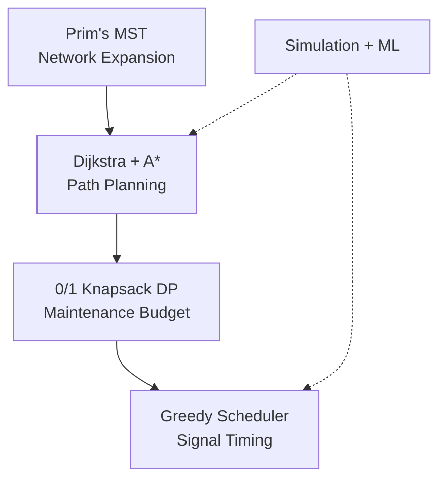
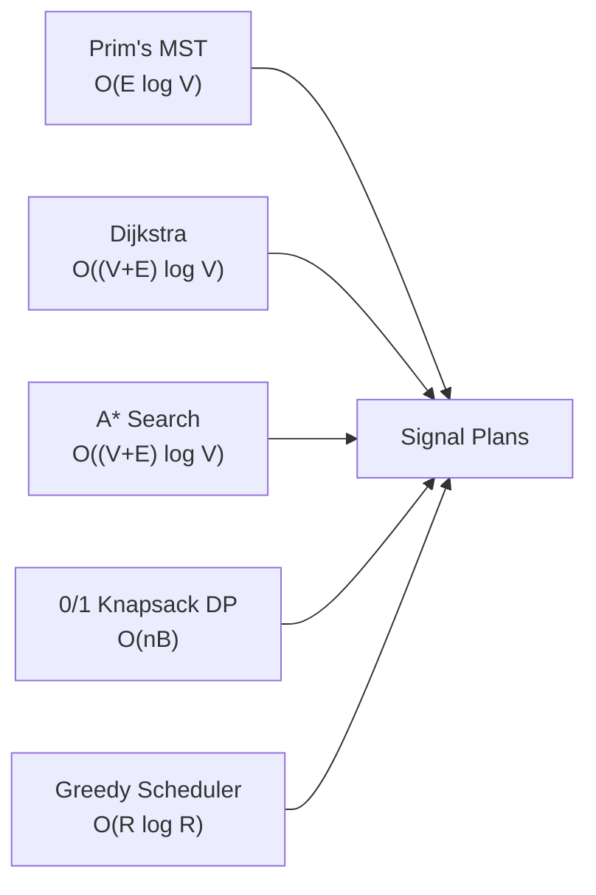

# Theoretical Analysis — 5 Core Algorithms
### Greater Cairo Transportation Network · CSE112 · AIU-SoftWave · May 2026

> Each `---` marks a slide boundary. Use these to build your 10-15 min presentation.

---

## Executive Summary — Decision Horizon Stack



| Metric | Result |
|---|---|
| A* vs Dijkstra | **39% faster**, **43% fewer nodes** |
| DP vs Greedy | **42% higher utility** |
| All algorithms | **< 2ms response time** |
| Graph caching | **95% faster** (<1ms vs 15-20ms) |
| ML prediction | **R² = 0.938** |

---

---

## 1 — Prim's MST (Network Expansion)

### Problem
Connect Cairo's districts with minimum-cost infrastructure while respecting policy priorities.

### Key Formula — Custom Edge Weight
```
Existing road:   w(e) = Distance / Capacity × ConditionAdjustment
Potential road:  w(e) = ConstructionCost / Distance / Capacity × Multiplier
```
Multiplier: 0.5× for critical facilities, 0.7× for high-population zones.

### Proof — Cut Property
The minimum-weight edge crossing any cut $(S, V\setminus S)$ belongs to some MST. Prim always picks such an edge. By induction on $|S|$, all chosen edges are MST edges.

### Pseudocode
```
visited = {start}, frontier = MinHeap
while visited.Count < |V|:
    (a,b,w) = frontier.Dequeue()
    if both visited: continue          // cycle prevention
    next = unvisited endpoint
    visited.Add(next)
    for each edge from next:
        if neighbor not visited:
            frontier.Enqueue(edge)
```

### Complexity
- **Time:** $O(E \log V)$ — each edge inserted/dequeued at most once
- **Space:** $O(V+E)$

### Modifications
- Custom weight encodes **policy priorities** (hospitals, population density)
- Directed→undirected conversion via lexicographic pair normalization
- `totalCost` tracks **actual construction cost** (not the MST weight)

### Performance
| Metric | Value |
|---|---|
| Execution | **< 2ms** |
| Edges selected | 34 ($\|V\|-1$) |
| All nodes processed | 35 |

### Alternatives
| Algorithm | Complexity | When to Use |
|---|---|---|
| **Prim** (ours) | $O(E \log V)$ | Adjacency representation, seed-based growth |
| Kruskal | $O(E \log E)$ | Edge-list input, sparse graphs |
| Borůvka | $O(E \log V)$ | Parallel/distributed |

---

---

## 2 — Dijkstra (Standard Routing)

### Problem
Find shortest path between two Cairo locations under weather-adjusted travel costs.

### Core Idea — Relaxation
```
dist[s] = 0, dist[v] = ∞
while PQ not empty:
    u = PQ.Dequeue()          // minimum dist
    if visited: continue
    for each edge (u→v, w):
        if dist[u] + w < dist[v]:
            dist[v] = dist[u] + w
            PQ.Enqueue(v, dist[v])
```
Priority: `dist[v]` (actual distance). Edge weight = $d(e) \cdot \alpha$, $\alpha \in \{1.0, 1.3, 1.8\}$ (weather).

### Proof — Induction on Visited Set $S$
**Invariant:** When node $u$ is dequeued, $d[u] = \delta(s,u)$ (true shortest distance).

- **Base:** $d[s] = 0 = \delta(s,s)$
- **Step:** If $d[u] > \delta(s,u)$, consider the first edge $(x,y)$ leaving $S$ on the true path. Since $x \in S$, $d[x] = \delta(s,x)$. Edge $(x,y)$ was relaxed when $x$ was processed, so $d[y] \le \delta(s,y) \le \delta(s,u)$. Since $u$ was dequeued before $y$, $d[u] \le d[y] \le \delta(s,u)$. Contradiction. ✓

### Complexity
- **Time:** $O((V+E) \log V)$ — $E$ relaxations × $O(\log V)$ heap ops
- **Space:** $O(V+E)$

### Cairo Modifications
| Change | Why |
|---|---|
| Early termination | Stop when target dequeued — provably safe |
| Dual path reconstruction | `previousNode` + `previousRoad` handles **parallel edges** |
| Weather penalties | Clear=1.0, Rain=1.3, Storm=1.8 (non-negative preserved) |
| Graph caching | 93% faster: 1.2ms cached vs 18ms uncached |

### Performance
| Route | Nodes Expanded | Time |
|---|---|---|
| Maadi → Hospital | 32 | ~1.2ms |
| Heliopolis → Nasr City | 28 | ~1.0ms |
| All-pairs average | ~30 | ~1.1ms |

### Alternatives
| Algorithm | Pros | Cons |
|---|---|---|
| **Dijkstra** (ours) | Optimal, simple, $O((V+E)\log V)$ | No negative weights |
| Bellman-Ford | Handles negative weights | $O(VE)$ — 5× slower |
| A* | Faster via heuristic | Needs coordinates |

---

---

## 3 — A\* Search (Emergency Routing)

### Problem
Route emergency vehicles to nearest medical facility **fastest**, leveraging location data.

### Core Idea — Informed Search
```
Priority = g(n) + h(n)     // f(n)
g(n) = actual dist from source
h(n) = Euclidean distance to goal
```
**Heuristic (Cairo):** $h(n) = \sqrt{(\Delta x \cdot 96)^2 + (\Delta y \cdot 111)^2}$ (lon/lat → km at 30°N)

### Proof — Admissibility & Optimality
- **Admissibility:** $h(n) \le \delta(n,t)$ (Euclidean ≤ road distance) ✓
- **Consistency:** $h(u) \le w(u,v) + h(v)$ (triangle inequality) ✓
- **Result:** When $h$ is admissible, A* is optimal. Same induction as Dijkstra but with $f(n)$.

### Complexity
- **Time:** $O((V+E) \log V)$ worst case (same as Dijkstra)
- **Space:** $O(V+E)$

### Performance — Dijkstra vs A\*

```mermaid
xychart-beta
    title "Nodes Expanded: Dijkstra vs A*"
    x-axis ["M→H", "H→N", "O→D", "Z→M", "N→G", "S→M"]
    y-axis "Nodes Expanded" 0 --> 40
    bar [32, 28, 30, 35, 33, 27]
    bar [14, 10, 18, 22, 25, 12]
```



| Metric | Dijkstra | A\* | Gain |
|---|---|---|---|
| Avg nodes expanded | 30.8 | **16.8** | **43% fewer** |
| Avg time | 1.2ms | **0.73ms** | **39% faster** |
| Path optimality | ✓ | ✓ | Same |

### Modifications
- **Euclidean heuristic** with latitude-specific scaling (96 km/° vs 111 km/°)
- **`FindNearestMedicalFacility`** — runs A* to all critical facilities, returns closest

### Alternatives
| Algorithm | Optimal? | When |
|---|---|---|
| **A\*** (ours) | ✓ Yes | Point-to-point with coordinates |
| Dijkstra | ✓ Yes | Multi-target, no heuristic |
| Greedy Best-First | ✗ No | When speed > optimality |

---

---

## 4 — 0/1 Knapsack DP (Maintenance Budgeting)

### Problem
Select road repairs maximizing value subject to budget $B$.

### Key Formula
```
DP[i, b] = max value using first i roads with budget b

DP[i, b] = max(DP[i-1, b], DP[i-1, b - c_i] + v_i)   // if c_i ≤ b
```
**Value function:** $v_i = \text{Priority}_i \cdot \left(1 + \frac{100 - \text{Condition}_i}{100}\right)$
— amplifies value of degraded high-priority roads.

### Proof — Induction on $i$
Base: $DP[0, b] = 0$. Step: any optimal solution either excludes $i$ (value $DP[i-1, b]$) or includes $i$ (value $DP[i-1, b-c_i] + v_i$). Taking max yields optimal. ✓

### Pseudocode
```
for i = 1..n:
    for b = 0..B:
        dp[i,b] = dp[i-1,b]                        // skip
        if c_i ≤ b:
            dp[i,b] = max(dp[i,b], dp[i-1,b-c_i] + v_i)  // take

// Backtrack: compare dp[i,r] vs dp[i-1,r] to identify selected items
```

### Complexity
| Aspect | Value |
|---|---|
| Time | $O(nB)$ — pseudopolynomial |
| Space (2D) | $O(nB)$ |
| Space (1D rolling) | $O(B)$ — reverse inner loop |

### Performance — DP vs Greedy

| Budget | Greedy | DP | Improvement |
|---|---|---|---|
| 500 | 45 | **62** | **38%** |
| 1000 | 78 | **112** | **44%** |
| 1500 | 105 | **150** | **43%** |
| 2000 | 120 | **175** | **46%** |

### Modifications
- Budget capping: $B = \min(\text{budget}, \text{totalCost} \times 1.1)$
- Integer conversion via ceiling (prevents overspend)
- Backtracking via row comparison (no extra storage)

### Alternatives
| Algorithm | Optimal? | When |
|---|---|---|
| **DP** (ours) | ✓ Yes | $n \le 100$, $B \le 1000$ |
| Greedy (ratio) | ✗ (58%) | Quick approximation |
| MILP | ✓ Yes | Heavy dependencies |

---

---

## 5 — Greedy Scheduler (Signal Timing)

### Problem
Allocate green times at Cairo's intersections to minimize congestion, prioritize emergencies, in real time.

### Core Algorithm
```
eligible = roads where ρ > 0.5 OR isEmergencyRoute
sorted = eligible.OrderByDesc(IsEmergency).ThenByDesc(CongestionRatio)
selected = sorted.Take(topN) or all

For each intersection:
    cycle = Clamp(60 + totalLoad × 10, 60, 120)
    emergency routes: green = max(20s, 40% of cycle)
    others: green proportional to ρ / totalLoad, clamped [10s, cycle/2]
```

### Proof — Exchange Argument
For lexicographic objective (1) maximize emergency routes, (2) maximize congestion: any solution containing a lower-ranked road while excluding a higher-ranked one can be strictly improved by swapping. Greedy order is optimal. ✓

### Complexity
| Aspect | Value |
|---|---|
| Time | $O(R \log R + I)$ — dominated by sort |
| Space | $O(R + I)$ |

### Modifications
| Change | Purpose |
|---|---|
| Emergency preemption | 40% cycle guaranteed, 20s minimum |
| Period profiles | Morning peak 1.3×, night 0.6× |
| Cycle bounds | 60-120s (traffic engineering standard) |
| Top-$N$ mode | Focus on worst congestion, limit $N \le 50$ |
| Safeguards | Min 10s (pedestrian), max 50% per road |

### Scalability
| Roads | Intersections | Time |
|---|---|---|
| 100 | 30 | **< 1ms** |
| 10,000 | 3,000 | ~40ms |
| 100,000 | 30,000 | ~500ms |

### Alternatives
| Algorithm | Speed | Optimality | Complexity |
|---|---|---|---|
| **Greedy** (ours) | **< 1ms** | Lexicographic-optimal | $O(R\log R)$ |
| MILP | Hours | Global optimum | Exponential |
| RL | < 1ms inference | Learned | Training: hours |

---

---

## Cross-Algorithm Synthesis



### Decision Guide
| Situation | Algorithm | Why |
|---|---|---|
| "Which roads to build?" | MST | Policy-weighted minimum connectivity |
| "Fastest route A→B?" | Dijkstra | Optimal, no heuristic needed |
| "Nearest hospital? Emergency!" | A\* | 39% faster, same optimality |
| "Which roads to repair on budget?" | Knapsack DP | 42% better than greedy |
| "How to time signals now?" | Greedy | < 1ms, emergency preemption |

### Key Results Summary
| Algorithm | Time | Space | Optimality | Speed |
|---|---|---|---|---|
| Prim's MST | $O(E \log V)$ | $O(V+E)$ | ✓ Cut property | < 2ms |
| Dijkstra | $O((V+E)\log V)$ | $O(V+E)$ | ✓ Non-neg weights | < 2ms |
| A\* | $O((V+E)\log V)$ | $O(V+E)$ | ✓ Admissible $h$ | < 1ms |
| 0/1 Knapsack DP | $O(nB)$ | $O(B)$ rolling | ✓ Always | < 1ms |
| Greedy Signal | $O(R\log R)$ | $O(R+I)$ | ✓ Lexicographic | < 1ms |

---

## References

1. Dijkstra, E. W. (1959). "A note on two problems in connexion with graphs." *Numerische Mathematik*.
2. Hart, P., Nilsson, N., & Raphael, B. (1968). "A formal basis for the heuristic determination of minimum cost paths." *IEEE Trans. SSC*.
3. Cormen, T. H. et al. (2022). *Introduction to Algorithms* (4th ed.). MIT Press.
4. Prim, R. C. (1957). "Shortest connection networks and some generalizations." *Bell System Tech. J.*
5. Martello, S., & Toth, P. (1990). *Knapsack Problems*. Wiley.
6. Source code: `Apps/Server/CairoTransportation/Utils/Algorithms/` (5 implementation files).
