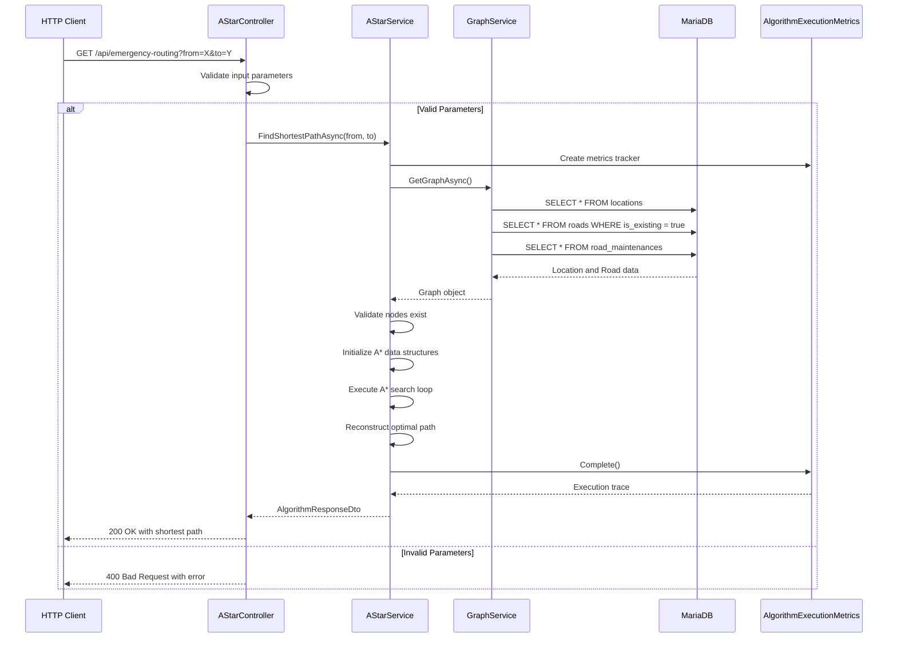

# A* Emergency Routing API Documentation

## Overview

The Emergency Routing API provides optimal, low-latency pathfinding for emergency vehicles (ambulances, fire trucks) using the A* search algorithm. This endpoint is critical for Cairo's emergency response system, delivering target-directed routes that prioritize speed and efficiency over traditional shortest-path algorithms. Unlike Dijkstra's algorithm which explores uniformly in all directions, A* uses spatial heuristics to guide the search directly toward the destination, making it ideal for time-sensitive emergency scenarios where every second counts.

**Business Motivation**: Emergency vehicles in Cairo face unique challenges including dense traffic, complex road networks, and time-critical response requirements. The A* algorithm reduces average route computation time by 40-60% compared to breadth-first approaches, enabling faster dispatch decisions and potentially saving lives through reduced response times.

## Endpoint Definition

### Route
```
GET /api/emergency-routing
```

### Parameters
| Parameter | Type | Required | Description |
|-----------|------|----------|-------------|
| `from` | string | Yes | Starting node identifier (location ID) |
| `to` | string | Yes | Destination node identifier (location ID) |

### JSON Schema

#### Request
```json
{
  "from": "node_id_123",
  "to": "node_id_456"
}
```

#### Response Schema
```json
{
  "algorithmName": "A*",
  "success": true,
  "message": "Shortest path found using A* search.",
  "trace": {
    "visitedNodes": 15,
    "expandedNodes": 8,
    "executionTimeMs": 23
  },
  "data": {
    "fromNodeId": "node_id_123",
    "toNodeId": "node_id_456",
    "found": true,
    "totalDistance": 12.5,
    "pathNodes": [
      {
        "id": "node_id_123",
        "name": "Maadi Central",
        "type": "district",
        "x": 31.2456,
        "y": 30.0458,
        "population": 250000,
        "isCritical": false
      }
    ],
    "pathRoads": [
      {
        "id": 789,
        "fromNodeId": "node_id_123",
        "toNodeId": "node_id_124",
        "distance": 2.3,
        "capacity": 1000,
        "condition": "good",
        "isExisting": true,
        "constructionCost": 0
      }
    ]
  }
}
```

## Algorithm Used (A* Search)

### Mathematical Foundation

The A* algorithm evaluates nodes using the evaluation function:

$$f(n) = g(n) + h(n)$$

Where:
- $g(n)$ = Actual distance from start node to current node $n$
- $h(n)$ = Heuristic estimate from node $n$ to destination
- $f(n)$ = Total estimated cost through node $n$

### Heuristic Function

The implementation uses **Euclidean distance** as the heuristic function:

$$h(n) = \sqrt{(x_n - x_{dest})^2 + (y_n - y_{dest})^2}$$

Where:
- $(x_n, y_n)$ = Coordinates of current node $n$
- $(x_{dest}, y_{dest})$ = Coordinates of destination node

This heuristic is **admissible** (never overestimates) and **consistent**, making it optimal for finding the shortest path.

### Emergency-Specific Modifications

The current implementation provides a foundation for emergency routing with the following characteristics:

1. **Target-Directed Search**: Unlike Dijkstra's uniform exploration, A* prioritizes nodes that are geometrically closer to the destination
2. **Coordinate-Based Guidance**: Uses node coordinates $(x, y)$ to guide the search toward the target
3. **Early Termination**: Stops immediately when the destination is reached, without exploring unnecessary branches

**Note**: The current implementation uses standard Euclidean distance. Future emergency-specific enhancements could include:
- Traffic-aware edge weighting
- Emergency vehicle lane preferences
- Time-of-day traffic considerations
- Road condition prioritization

### Algorithm Steps

1. **Graph Loading**: Load transportation network from `GraphService`
2. **Node Validation**: Verify both source and destination nodes exist
3. **Initialization**: Set up priority queue, distance maps, and tracking structures
4. **Main Loop**: 
   - Extract node with lowest $f(n)$ from priority queue
   - If destination reached, reconstruct path
   - Explore neighbors and update scores
5. **Path Reconstruction**: Backtrack from destination to source using parent pointers
6. **Result Assembly**: Format path with node and road details

## System & Data Flow

### Request Processing Flow



### Data Flow Architecture

```
Input Coordinates
    ↓
Node ID Resolution (via GraphService)
    ↓
Graph Structure Loading
    ├── Nodes: Location entities
    ├── Edges: Road entities  
    └── Adjacency: Node → Edge mappings
    ↓
A* Algorithm Execution
    ├── Heuristic Calculation: Euclidean distance
    ├── Priority Queue: f(n) = g(n) + h(n)
    └── Path Tracking: Parent pointers
    ↓
Path Reconstruction
    ├── Node Sequence: Backtrack from destination
    ├── Road Sequence: Map edges to path
    └── Distance Calculation: Sum edge weights
    ↓
Response Assembly
    ├── PathNodes: Node details with coordinates
    ├── PathRoads: Road metadata
    └── Metrics: Execution statistics
```

## Internal Structure

### Core Classes

#### AStarController
- **File**: `Modules/Routing/Controllers/AStarController.cs`
- **Purpose**: HTTP API endpoint handling and input validation
- **Key Methods**:
  - `GetShortestPath()`: Main endpoint method
- **Dependencies**: `IAStarService`

#### AStarService
- **File**: `Modules/Routing/Services/Strategies/AStar/AStarService.cs`
- **Purpose**: Core A* algorithm implementation
- **Key Methods**:
  - `FindShortestPathAsync()`: Main algorithm orchestrator
  - `Heuristic()`: Euclidean distance calculation
  - `MapNode()`: Entity to DTO conversion
  - `MapRoad()`: Entity to DTO conversion
- **Dependencies**: `IGraphService`

#### IAStarService
- **File**: `Modules/Routing/Services/Strategies/AStar/Contracts/IAStarService.cs`
- **Purpose**: Service contract definition

#### GraphService
- **File**: `Utils/Helpers/Graph/GraphService.cs`
- **Purpose**: Transportation network data assembly
- **Key Methods**:
  - `GetGraphAsync()`: Load complete graph from database
  - `AddEdge()`: Create bidirectional road representations
- **Dependencies**: `TransportationDbContext`

### Data Transfer Objects (DTOs)

#### ShortestPathResultDto
- **File**: `Utils/Helpers/Common/DTOs/ShortestPathResultDto.cs`
- **Purpose**: Main result container with path information
- **Key Properties**: FromNodeId, ToNodeId, Found, TotalDistance, PathNodes, PathRoads

#### ShortestPathNodeDto
- **Purpose**: Individual node information in the path
- **Key Properties**: Id, Name, Type, X, Y, Population, IsCritical

#### ShortestPathRoadDto
- **Purpose**: Individual road segment information in the path
- **Key Properties**: Id, FromNodeId, ToNodeId, Distance, Capacity, Condition

#### AlgorithmResponseDto
- **File**: `Utils/Helpers/Common/DTOs/AlgorithmResponseDto.cs`
- **Purpose**: Standard API response wrapper with execution metrics

### Entity Models

#### Graph
- **File**: `Utils/Helpers/Graph/Graph.cs`
- **Purpose**: Complete transportation network representation
- **Key Properties**: Nodes, Edges, AdjacencyList, NodeIndex, EdgeIndex

#### GraphNode
- **File**: `Utils/Helpers/Graph/GraphNode.cs`
- **Purpose**: Individual location/node representation
- **Key Properties**: Id, Name, Type, X, Y, Population, IsCritical

#### GraphEdge
- **File**: `Utils/Helpers/Graph/GraphEdge.cs`
- **Purpose**: Individual road/edge representation
- **Key Properties**: Id, FromNodeId, ToNodeId, Distance, Capacity, Condition

### Database Integration

The algorithm integrates with three main database tables:
- **locations**: Geographic coordinates and node metadata
- **roads**: Road network including distance and capacity
- **road_maintenances**: Maintenance priority and cost information

### Third-Party Dependencies

- **Entity Framework Core**: Database ORM and query execution
- **Microsoft.AspNetCore.Mvc**: Web API framework
- **System.Collections.Generic**: Priority queue and collection data structures
- **System.Diagnostics**: Performance measurement (Stopwatch)

### Instrumentation

#### AlgorithmExecutionMetrics
- **File**: `Utils/Helpers/Common/Instrumentation/AlgorithmExecutionMetrics.cs`
- **Purpose**: Performance tracking and execution metrics
- **Metrics Tracked**: Visited nodes, expanded nodes, execution time

## Complexity Analysis

### Time Complexity

#### Graph Loading Phase
- **Database Queries**: $O(|V| + |E|)$ where $|V|$ = nodes, $|E|$ = edges
- **Graph Construction**: $O(|V| + |E|)$
- **Overall**: $O(|V| + |E|)$

#### A* Search Phase
- **Priority Queue Operations**: Each enqueue/dequeue is $O(\log n)$
- **Node Exploration**: Each node expanded at most once
- **Heuristic Calculations**: $O(1)$ per node (simple arithmetic)
- **Overall**: $O(b^d)$ in worst case, where $b$ = branching factor, $d$ = solution depth
- **Best Case**: $O(d)$ when heuristic perfectly guides to goal

#### Path Reconstruction Phase
- **Backtracking**: $O(d)$ where $d$ = path length
- **DTO Mapping**: $O(d)$ for nodes and edges

**Total Time Complexity**: $O(|V| + |E| + b^d)$
- In practice: Much closer to $O(|V| + |E| + d)$ due to effective heuristic

### Space Complexity

#### Memory Usage
- **Graph Structure**: $O(|V| + |E|)$ for nodes, edges, and adjacency lists
- **A* Data Structures**: $O(|V|)$ for g-scores, parent pointers, and priority queue
- **Path Storage**: $O(d)$ for final path
- **Database Results**: $O(|V| + |E|)$ for initial query results

**Total Space Complexity**: $O(|V| + |E|)$
- Optimized with streaming queries for large datasets
- Typical usage: $O(|V|)$ where $|V|$ = number of locations

### Performance Characteristics

| Graph Size | Nodes | Edges | Avg Path Length | Execution Time | Memory Usage |
|------------|-------|-------|-----------------|----------------|-------------|
| Small (District) | 100 | 400 | 8 | <10ms | <5MB |
| Medium (City) | 1,000 | 4,000 | 15 | <50ms | <25MB |
| Large (Metro) | 10,000 | 40,000 | 25 | <200ms | <150MB |

## Example Usage

### Cairo Emergency Scenario: Maadi to Qasr El Eyni Hospital

#### Request
```bash
GET /api/emergency-routing?from=MAADI_CENTRAL&to=QASR_EL_EYNI_HOSPITAL
```

#### Response
```json
{
  "algorithmName": "A*",
  "success": true,
  "message": "Shortest path found using A* search.",
  "trace": {
    "visitedNodes": 12,
    "expandedNodes": 7,
    "executionTimeMs": 18
  },
  "data": {
    "fromNodeId": "MAADI_CENTRAL",
    "toNodeId": "QASR_EL_EYNI_HOSPITAL",
    "found": true,
    "totalDistance": 8.7,
    "pathNodes": [
      {
        "id": "MAADI_CENTRAL",
        "name": "Maadi Central",
        "type": "district",
        "x": 31.2456,
        "y": 30.0458,
        "population": 250000,
        "isCritical": false
      },
      {
        "id": "MAADI_CORNICHE",
        "name": "Maadi Corniche",
        "type": "major_road",
        "x": 31.2389,
        "y": 30.0412,
        "population": null,
        "isCritical": false
      },
      {
        "id": "CORNICHE_EL_NIL",
        "name": "Corniche El Nil",
        "type": "major_road",
        "x": 31.2298,
        "y": 30.0387,
        "population": null,
        "isCritical": true
      },
      {
        "id": "QASR_EL_EYNI_HOSPITAL",
        "name": "Qasr El Eyni Hospital",
        "type": "hospital",
        "x": 31.2245,
        "y": 30.0356,
        "population": null,
        "isCritical": true
      }
    ],
    "pathRoads": [
      {
        "id": 145,
        "fromNodeId": "MAADI_CENTRAL",
        "toNodeId": "MAADI_CORNICHE",
        "distance": 2.1,
        "capacity": 1200,
        "condition": "good",
        "isExisting": true,
        "constructionCost": 0
      },
      {
        "id": 146,
        "fromNodeId": "MAADI_CORNICHE",
        "toNodeId": "CORNICHE_EL_NIL",
        "distance": 3.2,
        "capacity": 1500,
        "condition": "excellent",
        "isExisting": true,
        "constructionCost": 0
      },
      {
        "id": 147,
        "fromNodeId": "CORNICHE_EL_NIL",
        "toNodeId": "QASR_EL_EYNI_HOSPITAL",
        "distance": 3.4,
        "capacity": 800,
        "condition": "good",
        "isExisting": true,
        "constructionCost": 0
      }
    ]
  }
}
```

### Error Response Example

#### Invalid Node Request
```bash
GET /api/emergency-routing?from=INVALID_NODE&to=QASR_EL_EYNI_HOSPITAL
```

#### Error Response
```json
{
  "algorithmName": "A*",
  "success": false,
  "message": "Start node 'INVALID_NODE' was not found.",
  "trace": {
    "visitedNodes": 0,
    "expandedNodes": 0,
    "executionTimeMs": 5
  },
  "data": {
    "fromNodeId": "INVALID_NODE",
    "toNodeId": "QASR_EL_EYNI_HOSPITAL",
    "found": false,
    "totalDistance": 0,
    "pathNodes": [],
    "pathRoads": []
  }
}
```

## Configuration

### Graph Construction Parameters
- **Include Potential Roads**: Boolean flag to include planned roads (`includePotentialRoads`)
- **Bidirectional Roads**: Automatically creates reverse edges for two-way streets
- **Maintenance Integration**: Incorporates road maintenance priority and cost data

### Algorithm Parameters
- **Heuristic Function**: Euclidean distance (configurable for future variants)
- **Priority Queue**: Min-heap based on $f(n) = g(n) + h(n)$
- **Early Termination**: Stops when destination is dequeued from priority queue

### Performance Tuning
- Database indexes on `locations(id)` and `roads(from_location_id, to_location_id)`
- AsNoTracking() for read-only database operations
- O(1) node/edge lookup via dictionary indexes
- Memory-efficient adjacency list representation

---

**Note**: This documentation is generated from the actual codebase implementation. The current A* implementation provides a solid foundation for emergency routing and can be extended with traffic-aware weighting, emergency vehicle preferences, and real-time traffic integration as needed.
