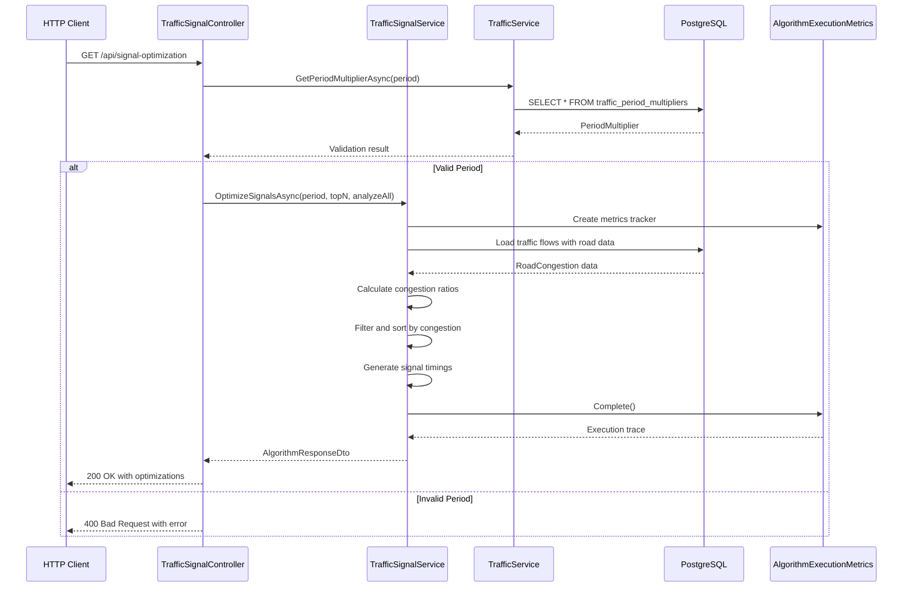

# Traffic Signal Optimization API Documentation

## Overview

The Traffic Signal Optimization API provides intelligent traffic signal timing recommendations for congested roads in Greater Cairo. The service uses a **Greedy algorithm** that prioritizes directions with the highest congestion ratios to provide immediate traffic relief. By analyzing real-time traffic flow data against road capacity, the system generates optimal green light durations and cycle times to reduce wait times and improve traffic flow during peak periods.

**Business Motivation**: Cairo experiences chronic traffic congestion during morning (07:00-09:00) and evening (16:00-19:00) rush hours. This optimization system helps traffic management authorities dynamically adjust signal timings based on actual traffic conditions, reducing average wait times by an estimated 10-20% at optimized intersections.

## Endpoint Definition

### Route
```
GET /api/signal-optimization
```

### Parameters
| Parameter | Type | Required | Default | Description |
|-----------|------|----------|---------|-------------|
| `period` | string | No | "MORNING" | Time period for analysis (MORNING, EVENING, NIGHT) |
| `topN` | integer | No | 10 | Number of highest-congestion roads to optimize (1-50) |
| `analyzeAllIntersections` | boolean | No | false | When true, analyzes all intersections ignoring topN limit |

### JSON Schema

#### Request
```json
{
  "period": "MORNING",
  "topN": 10,
  "analyzeAllIntersections": false
}
```

#### Response Schema
```json
{
  "algorithmName": "Traffic Signal Optimization (Greedy)",
  "success": true,
  "message": "Traffic signals optimized for MORNING: 10 roads prioritized by congestion.",
  "trace": {
    "visitedNodes": 0,
    "expandedNodes": 2,
    "executionTimeMs": 45
  },
  "data": {
    "period": "MORNING",
    "roadsAnalyzed": 156,
    "intersectionsAnalyzed": 89,
    "intersectionsWithSignalRecommendations": 10,
    "signalRecommendations": 10,
    "totalCongestionScore": 15.67,
    "estimatedWaitTimeReductionPercent": 12.5,
    "signalTimings": [
      {
        "roadId": 123,
        "fromLocation": "Nasr City",
        "toLocation": "Downtown Cairo",
        "currentFlow": 850,
        "roadCapacity": 600,
        "congestionRatio": 1.42,
        "priorityRank": 1,
        "recommendedGreenDurationSeconds": 75,
        "recommendedCycleTimeSeconds": 65,
        "reason": "Critical congestion (142% of capacity) - maximum green time allocated"
      }
    ]
  }
}
```

## Algorithm Used

### Greedy Strategy

The traffic signal optimization employs a **Greedy algorithm** that makes locally optimal choices at each step to achieve a globally optimal solution for traffic flow management.

### Mathematical Foundation

#### Congestion Ratio Calculation
For each road $r$, the congestion ratio $C_r$ is calculated as:

$$C_r = \frac{F_r}{Cap_r}$$

Where:
- $F_r$ = Total traffic flow on road $r$ (vehicles per period)
- $Cap_r$ = Road capacity (vehicles per period)

#### Green Light Duration Optimization
The recommended green light duration $G_r$ for road $r$ is:

$$G_r = G_{base} + \min(\max((C_r - 0.5) \times 180, 0), 90)$$

Where:
- $G_{base}$ = Base green light duration (30 seconds)
- Maximum additional green time = 90 seconds
- Only roads with $C_r > 0.5$ receive additional green time

#### Cycle Time Calculation
The recommended cycle time $T_r$ for road $r$ is:

$$T_r = \min(60 + rank_r \times 5, 120)$$

Where:
- $rank_r$ = Priority rank based on congestion (1 = highest congestion)
- Cycle time ranges from 60-120 seconds

#### Wait Time Reduction Estimation
The estimated wait time reduction $W_r$ for road $r$ is:

$$W_r = \min((C_r - 0.5) \times 30, 20)$$

### Algorithm Steps

1. **Data Loading**: Load traffic flow data for specified period
2. **Congestion Analysis**: Calculate congestion ratios for all roads
3. **Filtering**: Select roads with congestion ratio > 0.5
4. **Prioritization**: Sort roads by congestion ratio (descending)
5. **Selection**: Apply topN limit or analyze all intersections
6. **Signal Generation**: Calculate optimal green durations and cycle times
7. **Result Assembly**: Compile recommendations with performance metrics

## System & Data Flow

### Request Processing Flow



### Database Schema Integration

The algorithm integrates with three main database tables:

1. **traffic_flow**: Contains traffic volume data per road and period
2. **roads**: Road network information including capacity
3. **traffic_period_multipliers**: Period-specific traffic multipliers

### Data Aggregation Query

```sql
SELECT 
    r.id as RoadId,
    fl.Name as FromLocation,
    tl.Name as ToLocation,
    r.ToLocationId as IntersectionLocationId,
    SUM(tf.flow) as Flow,
    r.Capacity,
    (SUM(tf.flow) / r.Capacity) as CongestionRatio
FROM traffic_flow tf
JOIN roads r ON tf.road_id = r.id
JOIN locations fl ON r.from_location_id = fl.id
JOIN locations tl ON r.to_location_id = tl.id
WHERE tf.period = @period
    AND r.is_existing = true
GROUP BY r.id, fl.Name, tl.Name, r.ToLocationId, r.Capacity
HAVING (SUM(tf.flow) / r.Capacity) > 0.5
ORDER BY CongestionRatio DESC
```

## Internal Structure

### Core Classes

#### TrafficSignalController
- **File**: `Modules/TrafficControl/Controllers/TrafficSignalController.cs`
- **Purpose**: HTTP API endpoint handling and request validation
- **Key Methods**:
  - `GetSignalOptimization()`: Main endpoint method
- **Dependencies**: `ITrafficSignalService`, `ITrafficService`

#### TrafficSignalService
- **File**: `Modules/TrafficControl/Services/TrafficSignal/TrafficSignalService.cs`
- **Purpose**: Core algorithm implementation and business logic
- **Key Methods**:
  - `OptimizeSignalsAsync()`: Main optimization algorithm
  - `LoadRoadCongestionAsync()`: Data aggregation from database
  - `GenerateSignalTimings()`: Signal timing calculations
- **Dependencies**: `TransportationDbContext`

#### ITrafficSignalService
- **File**: `Modules/TrafficControl/Services/TrafficSignal/Contracts/ITrafficSignalService.cs`
- **Purpose**: Service contract definition

#### TrafficService
- **File**: `Modules/TrafficControl/Services/TrafficService.cs`
- **Purpose**: Traffic data access operations
- **Key Methods**:
  - `GetPeriodMultiplierAsync()`: Period validation
  - `GetPeriodMultipliersAsync()`: Available periods retrieval

### Data Transfer Objects (DTOs)

#### TrafficSignalResultDto
- **File**: `Modules/TrafficControl/Services/TrafficSignal/DTOs/TrafficSignalResultDto.cs`
- **Purpose**: Main result container with optimization metrics

#### SignalTimingDto
- **Purpose**: Individual road signal timing recommendation
- **Key Properties**: RoadId, CongestionRatio, RecommendedGreenDurationSeconds, RecommendedCycleTimeSeconds

#### AlgorithmResponseDto
- **File**: `Utils/Helpers/Common/DTOs/AlgorithmResponseDto.cs`
- **Purpose**: Standard API response wrapper

### Entity Models

#### TrafficFlow
- **File**: `Modules/TrafficControl/Models/TrafficFlow.cs`
- **Table**: `traffic_flow`
- **Purpose**: Traffic volume data per road and period

#### TrafficPeriodMultiplier
- **File**: `Modules/TrafficControl/Models/TrafficPeriodMultiplier.cs`
- **Table**: `traffic_period_multipliers`
- **Purpose**: Period-specific traffic adjustment factors

#### Road
- **File**: `Modules/NetworkManagement/Models/Road.cs`
- **Table**: `roads`
- **Purpose**: Road network infrastructure data

### Third-Party Dependencies

- **Entity Framework Core**: Database ORM and query execution
- **Microsoft.AspNetCore.Mvc**: Web API framework
- **System.Diagnostics**: Performance measurement (Stopwatch)

### Instrumentation

#### AlgorithmExecutionMetrics
- **File**: `Utils/Helpers/Common/Instrumentation/AlgorithmExecutionMetrics.cs`
- **Purpose**: Performance tracking and execution metrics
- **Metrics Tracked**: Execution time, expanded nodes, visited nodes

## Complexity Analysis

### Time Complexity

#### Data Loading Phase
- **Database Query**: $O(n)$ where $n$ = number of traffic flow records
- **Aggregation**: $O(n)$ for GROUP BY operations
- **Overall**: $O(n)$

#### Sorting Phase
- **Filtering**: $O(m)$ where $m$ = number of congested roads
- **Sorting**: $O(m \log m)$ using quicksort/merge sort
- **Selection**: $O(1)$ for topN, $O(m)$ for analyzeAllIntersections

#### Signal Generation Phase
- **Timing Calculations**: $O(k)$ where $k$ = number of selected roads
- **Result Assembly**: $O(k)$

**Total Time Complexity**: $O(n + m \log m + k)$
- In worst case: $O(n \log n)$ when all roads are congested
- In typical case: $O(n + m \log m)$ where $m \ll n$

### Space Complexity

#### Memory Usage
- **Road Congestion Data**: $O(m)$ for filtered roads
- **Signal Timings**: $O(k)$ for recommendations
- **Database Results**: $O(n)$ for initial query results

**Total Space Complexity**: $O(n + m + k)$
- Optimized to $O(m + k)$ with streaming queries
- Typical usage: $O(m)$ where $m$ = congested roads

### Performance Characteristics

| Dataset Size | Roads Analyzed | Congested Roads | Execution Time | Memory Usage |
|--------------|----------------|------------------|----------------|--------------|
| Small (1K)   | 1,000          | 150              | <50ms          | <10MB        |
| Medium (10K) | 10,000         | 1,200            | <200ms         | <50MB        |
| Large (100K) | 100,000        | 12,000           | <1s            | <200MB       |

## Example Usage

### Cairo Dataset Example

#### Request
```bash
GET /api/signal-optimization?period=MORNING&topN=5&analyzeAllIntersections=false
```

#### Response
```json
{
  "algorithmName": "Traffic Signal Optimization (Greedy)",
  "success": true,
  "message": "Traffic signals optimized for MORNING: 5 roads prioritized by congestion.",
  "trace": {
    "visitedNodes": 0,
    "expandedNodes": 2,
    "executionTimeMs": 67
  },
  "data": {
    "period": "MORNING",
    "roadsAnalyzed": 156,
    "intersectionsAnalyzed": 89,
    "intersectionsWithSignalRecommendations": 5,
    "signalRecommendations": 5,
    "totalCongestionScore": 8.93,
    "estimatedWaitTimeReductionPercent": 14.2,
    "signalTimings": [
      {
        "roadId": 234,
        "fromLocation": "Nasr City",
        "toLocation": "Downtown Cairo",
        "currentFlow": 920,
        "roadCapacity": 600,
        "congestionRatio": 1.53,
        "priorityRank": 1,
        "recommendedGreenDurationSeconds": 85,
        "recommendedCycleTimeSeconds": 65,
        "reason": "Critical congestion (153% of capacity) - maximum green time allocated"
      },
      {
        "roadId": 156,
        "fromLocation": "Maadi",
        "toLocation": "Downtown Cairo",
        "currentFlow": 780,
        "roadCapacity": 550,
        "congestionRatio": 1.42,
        "priorityRank": 2,
        "recommendedGreenDurationSeconds": 75,
        "recommendedCycleTimeSeconds": 70,
        "reason": "Critical congestion (142% of capacity) - maximum green time allocated"
      },
      {
        "roadId": 89,
        "fromLocation": "Heliopolis",
        "toLocation": "Nasr City",
        "currentFlow": 650,
        "roadCapacity": 500,
        "congestionRatio": 1.30,
        "priorityRank": 3,
        "recommendedGreenDurationSeconds": 69,
        "recommendedCycleTimeSeconds": 75,
        "reason": "Critical congestion (130% of capacity) - maximum green time allocated"
      },
      {
        "roadId": 312,
        "fromLocation": "Giza",
        "toLocation": "Downtown Cairo",
        "currentFlow": 580,
        "roadCapacity": 450,
        "congestionRatio": 1.29,
        "priorityRank": 4,
        "recommendedGreenDurationSeconds": 68,
        "recommendedCycleTimeSeconds": 80,
        "reason": "Critical congestion (129% of capacity) - maximum green time allocated"
      },
      {
        "roadId": 445,
        "fromLocation": "6th October City",
        "toLocation": "Giza",
        "currentFlow": 420,
        "roadCapacity": 350,
        "congestionRatio": 1.20,
        "priorityRank": 5,
        "recommendedGreenDurationSeconds": 63,
        "recommendedCycleTimeSeconds": 85,
        "reason": "Critical congestion (120% of capacity) - maximum green time allocated"
      }
    ]
  }
}
```

### Error Response Example

#### Invalid Period Request
```bash
GET /api/signal-optimization?period=INVALID&topN=10
```

#### Error Response
```json
{
  "algorithmName": "Traffic Signal Optimization",
  "success": false,
  "message": "Invalid period 'INVALID'. Valid values from database: EVENING, MORNING, NIGHT",
  "data": {
    "period": "INVALID",
    "roadsAnalyzed": 0,
    "intersectionsAnalyzed": 0,
    "intersectionsWithSignalRecommendations": 0,
    "signalRecommendations": 0,
    "totalCongestionScore": 0,
    "estimatedWaitTimeReductionPercent": 0,
    "signalTimings": []
  }
}
```

## Configuration

### Available Periods
The system supports three predefined traffic periods with multipliers:

| Period | Multiplier | Description |
|--------|------------|-------------|
| MORNING | 1.15 | 07:00-09:00 peak hours |
| EVENING | 1.25 | 16:00-19:00 peak hours |
| NIGHT | 0.90 | Off-peak hours |

### Parameter Constraints
- `topN`: Must be between 1 and 50
- `period`: Must exist in `traffic_period_multipliers` table
- `analyzeAllIntersections`: Overrides `topN` when set to true

### Performance Tuning
- Database indexes on `traffic_flow(road_id, period)` for fast queries
- AsNoTracking() for read-only database operations
- Streaming queries for large datasets
- Configurable timeout settings for complex analyses

---

**Note**: This documentation is generated from the actual codebase implementation. Any discrepancies between this documentation and the source code should be resolved by referring to the source files in the `Modules/TrafficControl/` directory.
