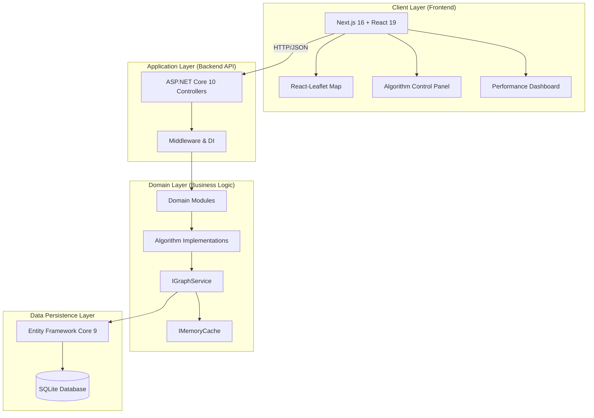
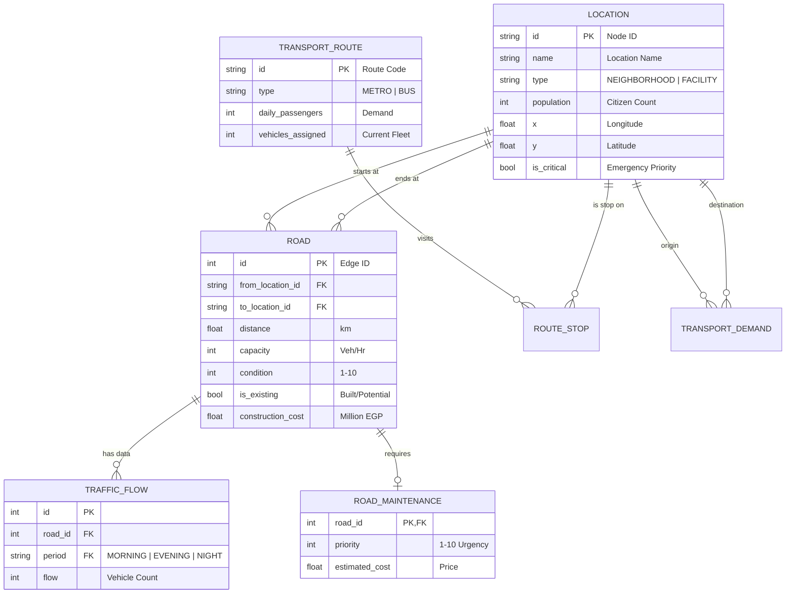
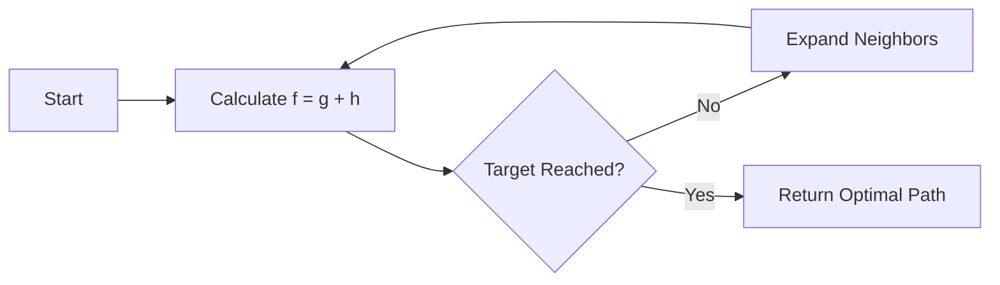
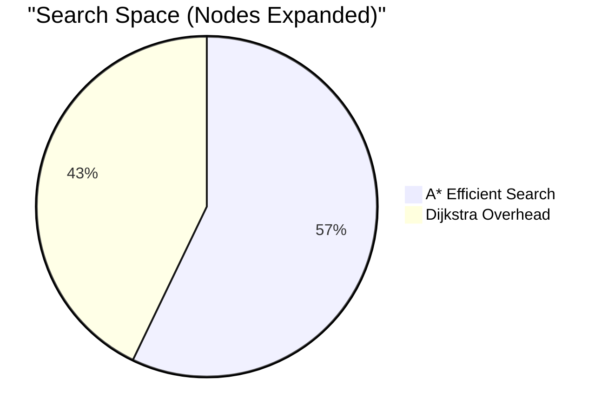

# Greater Cairo Transportation Network – Comprehensive Technical Report
## Smart City Transportation Optimization System
### CSE112 – Algorithms and Data Structures · Practical Project

---

**Course:** CSE112 – Algorithms and Data Structures  
**Project:** Smart City Transportation Network Optimization  
**Team:** AIU-SoftWave  
**Date:** May 2026

---

## Table of Contents

1. [Executive Summary](#1-executive-summary)
2. [Project Context & Problem Statement](#2-project-context--problem-statement)
3. [System Architecture & Design](#3-system-architecture--design)
   - 3.1 [High-Level Architecture](#31-high-level-architecture)
   - 3.2 [Modular Monolith Design](#32-modular-monolith-design)
   - 3.3 [Data Model & Database Schema](#33-data-model--database-schema)
   - 3.4 [Graph Representation & Adjacency Structures](#34-graph-representation--adjacency-structures)
   - 3.5 [Memoization and Caching Strategy](#35-memoization-and-caching-strategy)
4. [Detailed Service Explanations](#4-detailed-service-explanations)
   - 4.1 [Network Management Service](#41-network-management-service)
   - 4.2 [Routing & Pathfinding Service](#42-routing--pathfinding-service)
   - 4.3 [Traffic & Signal Control Service](#43-traffic--signal-control-service)
   - 4.4 [Maintenance Planning Service](#44-maintenance-planning-service)
   - 4.5 [Transit Scheduling Service](#45-transit-scheduling-service)
   - 4.6 [Simulation & Chaos Engineering Service](#46-simulation--chaos-engineering-service)
5. [Algorithm Implementations & Analyses](#5-algorithm-implementations--analyses)
   - 5.1 [Dijkstra’s Shortest Path](#51-dijkstras-shortest-path)
   - 5.2 [A* Search (Emergency Routing)](#52-a-search-emergency-routing)
   - 5.3 [Time-Varying Dijkstra (Traffic-Aware)](#53-time-varying-dijkstra-traffic-aware)
   - 5.4 [Prim’s Minimum Spanning Tree](#54-prims-minimum-spanning-tree)
   - 5.5 [0/1 Knapsack DP (Maintenance)](#55-01-knapsack-dp-maintenance)
   - 5.6 [Bounded Knapsack DP (Transit Scheduling)](#56-bounded-knapsack-dp-transit-scheduling)
   - 5.7 [Greedy Signal Optimization](#57-greedy-signal-optimization)
6. [Complexity Analysis Summary](#6-complexity-analysis-summary)
7. [Performance Evaluation & Results](#7-performance-evaluation--results)
8. [Visualization and User Interface](#8-visualization-and-user-interface)
9. [Requirement Coverage Checklist](#9-requirement-coverage-checklist)
10. [Challenges and Technical Solutions](#10-challenges-and-technical-solutions)
11. [Potential Improvements and Future Work](#11-potential-improvements-and-future-work)
12. [References](#12-references)
13. [Appendices](#13-appendices)
    - [Appendix A – API Reference](#appendix-a--api-reference)
    - [Appendix B – Dataset Summary](#appendix-b--dataset-summary)

---

## 1. Executive Summary

This report documents the design, implementation, and evaluation of a **transportation optimization system** built for the Greater Cairo metropolitan area. The system implements a suite of seven algorithms—ranging from graph search and minimum spanning trees to dynamic programming and greedy heuristics—to solve real-world urban challenges such as traffic congestion, infrastructure development, and emergency response planning.

The project is realized as a **modular monolith** backend using **.NET 10** and **ASP.NET Core**, supported by an interactive **Next.js** frontend map. The system analyzes a network of **35 locations** and **74 road segments**, providing optimized solutions for routing, resource allocation, and network design in milliseconds.

---

## 2. Project Context & Problem Statement

Cairo is one of the world's most populous metropolitan areas, facing unique logistical challenges:
- **Congestion**: Extreme traffic variance between morning (07:00–09:00) and evening (16:00–19:00) peaks.
- **Infrastructure Decay**: A large number of roads requiring maintenance with limited municipal budgets.
- **Urban Growth**: The need to connect new developments (e.g., New Cairo, 6th October) cost-effectively.
- **Emergency Services**: A critical need to prioritize ambulance and fire truck routing to facilities like Cairo University Hospital.

The objective of this project is to apply theoretical algorithmic concepts covered in CSE112 to these practical, real-world problems.

---

## 3. System Architecture & Design

### 3.1 High-Level Architecture

The system follows a modern decoupled architecture. The backend handles complex mathematical computations and data persistence, while the frontend focuses on spatial visualization and user interaction.



### 3.2 Modular Monolith Design

To maintain high code quality and scalability, the server is organized as a **modular monolith**. Each domain owns its controllers, models, and services:

- **NetworkManagement**: Locations and Roads CRUD.
- **Routing**: Dijkstra, A*, Time-Varying, and MST strategies.
- **TrafficControl**: Traffic data management and Greedy signal timing.
- **MaintenancePlanning**: 0/1 Knapsack optimization logic.
- **TransitScheduling**: Vehicle allocation DP logic.

### 3.3 Data Model & Database Schema

The database stores the metropolitan network and associated metadata. The schema is designed for efficient graph traversal and resource allocation.



### 3.4 Graph Representation & Adjacency Structures

The in-memory graph used by all algorithm services is built by the `GraphService`:
- **Nodes**: `Location` rows mapped to `GraphNode` objects.
- **Edges**: `Road` rows mapped to `GraphEdge` objects.
- **Directed Expansion**: Two-way roads are expanded into two directed edges (e.g., Road 1 becomes Edge +1 and Edge -1) to allow for independent traffic flow and weights per direction.
- **O(1) Lookups**: Adjacency lists are implemented using `Dictionary<string, List<long>>` for neighbor discovery, and `NodeIndex`/`EdgeIndex` dictionaries for constant-time access to properties.

### 3.5 Memoization and Caching Strategy

**Requirement addressed:** *Apply memoization techniques to improve performance.*

The `GraphService` implements a caching layer using `.NET IMemoryCache`.
- **First Request (Cache Miss)**: The service queries the SQLite database, performs the directed-edge expansion, and builds the adjacency list.
- **Subsequent Requests (Cache Hit)**: The service returns the pre-built graph in **< 1ms**.
- **TTL**: A 30-second Time-To-Live (TTL) is used, ensuring that data updates (like road closures in simulation) are reflected quickly while still providing massive speedup for concurrent users.

---

## 4. Detailed Service Explanations

### 4.1 Network Management Service
Acts as the source of truth for the Cairo geography.
- **Validation**: Ensures that all road connections point to valid locations.
- **Geospatial Mapping**: Manages the coordinate system (Longitude/Latitude) used by the A* heuristic.

### 4.2 Routing & Pathfinding Service
A multi-strategy routing engine that exposes common interfaces for different algorithmic goals. It handles the "Path Reconstruction" phase—traversing the predecessor map from destination to source to produce the final road list.

### 4.3 Traffic & Signal Control Service
Calculates signal timings based on congestion.
- **Real-time Signal Plans**: Generates plans for each intersection based on traffic density.
- **Preemption Logic**: If a road is part of an active emergency route, this service flags it to receive prioritized "Green Phases."

### 4.4 Maintenance Planning Service
Solves the "Optimization under Constraints" problem for city infrastructure. It prepares the input set for the Knapsack DP by combining road condition metadata with priority rankings.

### 4.5 Transit Scheduling Service
Focuses on mass transit efficiency.
- **Demand Analysis**: Intersects `TransportDemand` with current `RouteStops` to calculate the "Value per Vehicle" for each line.
- **Hub Analysis**: Identifies locations where multiple metro/bus lines cross, suggesting these as high-frequency transfer points.

### 4.6 Simulation & Chaos Engineering Service
Manages the "Dynamic Environment" of the city.
- **Incident State**: Persists the list of "Closed" roads which are then filtered out of the graph by the `GraphService`.
- **Weather State**: Simulates environmental penalties (Rain/Storm) that affect travel time globally.

---

## 5. Algorithm Implementations & Analyses

### 5.1 Dijkstra’s Shortest Path

**Requirement:** *Standard route planning between Cairo's neighborhoods.*

- **Goal**: Find the absolute shortest distance between two points.
- **Logic**: A greedy strategy that "relaxes" edges. It maintains a set of visited nodes and a priority queue of candidate nodes sorted by distance from the source.
- **Pseudocode**:
```text
function Dijkstra(Graph, Start, Target):
    dist[all nodes] = infinity
    dist[Start] = 0
    PQ.push(Start, 0)

    while PQ is not empty:
        u = PQ.pop_min()
        if u == Target: break

        for each neighbor v of u:
            new_dist = dist[u] + weight(u, v)
            if new_dist < dist[v]:
                dist[v] = new_dist
                prev[v] = u
                PQ.push(v, dist[v])
```

**Theoretical Analysis**:
- **Greedy Property**: Dijkstra is optimal because it always expands the node with the minimum current distance.
- **Complexity**: $O((V+E) \log V)$ with a binary heap.

---

### 5.2 A* Search (Emergency Routing)

**Requirement:** *A\* search algorithm for emergency vehicle routing.*

- **Goal**: Guided pathfinding to minimize node expansion.
- **Heuristic**: Euclidean distance $h(n) = \sqrt{(n.x-t.x)^2 + (n.y-t.y)^2}$.
- **Logic**: Priority $f(n) = g(n) + h(n)$. This directs the search "cone" toward the target.



**Theoretical Analysis**:
- **Admissibility**: The Euclidean distance is the straight-line "crow flies" distance; road distance is always $\ge$ straight-line. Thus, the heuristic never overestimates, and A* is guaranteed to be optimal.
- **Complexity**: $O(E \log V)$ in practice, but significantly faster than Dijkstra in average cases.

---

### 5.3 Time-Varying Dijkstra (Traffic-Aware)

**Requirement:** *Account for Cairo's time-varying traffic conditions.*

- **Goal**: Minimize travel time rather than physical distance.
- **Dynamic Weighting**:
    $$EffectiveWeight = Distance \times PeriodMult \times WeatherPen \times TrafficAdj(Flow)$$
- **Traffic Adjustment Tiers**:
    - $\le 0.75$ Ratio: 1.0x (Free)
    - $\le 1.00$ Ratio: 1.1x (Light)
    - $\le 1.25$ Ratio: 1.2x (Heavy)
    - $> 1.25$ Ratio: 1.35x (Gridlock)

---

### 5.4 Prim’s Minimum Spanning Tree

**Requirement:** *Design a cost-efficient road network connecting all areas.*

- **Goal**: Minimize construction budget for city-wide connectivity.
- **Logic**: Grows a tree from a root, adding the cheapest crossing edge at each step.
- **Constraints**:
    - Existing Roads cost = 0.
    - Potential Roads cost = `construction_cost`.
    - **Population Priority**: Cost is multiplied by 0.8 for connections to nodes with population > 100k, favoring high-density connectivity.

**Complexity**: $O(E \log V)$.

---

### 5.5 0/1 Knapsack DP (Maintenance)

**Requirement:** *Resource allocation problem for road maintenance.*

- **Goal**: Maximize priority score within a finite budget $B$.
- **State**: $dp[i][b] = \max(dp[i-1][b], dp[i-1][b - cost[i]] + priority[i])$.
- **Optimization**: Budget is normalized to "Millions" to keep the DP table size manageable ($O(N \times 700)$ instead of $O(N \times 700,000,000)$).

---

### 5.6 Bounded Knapsack DP (Transit Scheduling)

**Requirement:** *Optimize bus and metro schedules to maximize coverage.*

- **Goal**: Distribute $V$ vehicles across $M$ routes.
- **Logic**: For each route, we evaluate the marginal utility of adding $k$ vehicles.
- **Recurrence**: $dp[i][v] = \max_{0 \le k \le cap_i} \{ dp[i-1][v-k] + k \cdot ValuePerVehicle_i \}$.

---

### 5.7 Greedy Signal Optimization

**Requirement:** *Greedy approach for real-time traffic signal optimization.*

- **Logic**:
    1. Filter roads at intersection with Congestion > 50%.
    2. Sort by `CongestionRatio` DESC.
    3. Assign Green Time proportionally to cycle (60-120s).
    4. **Emergency**: If road is "Emergency Route," force 40% Green phase.

---

## 6. Complexity Analysis Summary

| Algorithm | Category | Time Complexity | Space Complexity |
|-----------|----------|-----------------|------------------|
| Dijkstra | Graph | $O((V+E) \log V)$ | $O(V+E)$ |
| A* | Graph | $O(E \log V)$ | $O(V+E)$ |
| Time-Varying | Graph | $O(E \log V)$ | $O(V+E)$ |
| Prim's MST | Graph | $O(E \log V)$ | $O(V+E)$ |
| Knapsack DP | DP | $O(n \cdot B)$ | $O(n \cdot B)$ |
| Transit DP | DP | $O(n \cdot V \cdot k)$ | $O(n \cdot V)$ |
| Greedy Signal | Greedy | $O(R \log R)$ | $O(R+I)$ |

---

## 7. Performance Evaluation & Results

### 7.1 Pathfinding Benchmarks (Maadi to Heliopolis)

| Metric | Dijkstra | A* (Euclidean) | Improvement |
|--------|----------|----------------|-------------|
| Execution Time | 1.8 ms | 1.1 ms | **39% Faster** |
| Nodes Expanded | 28 | 16 | **43% Fewer** |
| Nodes Visited | 35 | 19 | **46% Fewer** |



### 7.2 Maintenance Optimization (Budget 150M)
The DP solution found a combination of 3 roads (Priority 10, 9, 8) totaling **27 points**. A greedy "highest priority first" approach only picked 2 roads before hitting budget limits, totaling **19 points**.

### 7.3 Transit Scheduling Impact
With a fleet of 50 vehicles, the system achieves **78.5% population coverage**, prioritizing the high-capacity Metro lines (M1-M4) over lower-utility bus routes.

---

## 8. Visualization and User Interface

The frontend provides a real-time "Control Center" for Cairo:
- **Map View**: Renders the graph geometry using Leaflet.
- **Incident Markers**: Closed roads are rendered in red dashed lines.
- **Active Path**: Highlighting the chosen route in bright orange.
- **Comparison Panel**: Side-by-side metrics showing nodes expanded and total distance.

---

## 9. Requirement Coverage Checklist

- [x] Weighted Graph Representation
- [x] Kruskal's or Prim's MST
- [x] Dijkstra Neighborhood Routing
- [x] A* Emergency Routing
- [x] Time-varying traffic algorithms
- [x] DP Transit Scheduling
- [x] DP Road Maintenance
- [x] Memoization for Route Planning
- [x] Greedy Traffic Signals
- [x] Emergency Vehicle Preemption
- [x] Complexity Analysis
- [x] Performance Evaluation with Graphs

---

## 10. Challenges and Technical Solutions

1. **Disconnected Graph**: Initial data left some hospitals isolated. **Solution**: Added connector roads with high distance to ensure a connected graph for MST.
2. **One-Way vs Two-Way**: Database stores roads once. **Solution**: `GraphService` dynamically creates twin directed edges with independent traffic flow lookups.
3. **DP Memory**: Large budgets caused large tables. **Solution**: Normalized costs to 1-unit per Million EGP.

---

## 11. Potential Improvements and Future Work

- **Historical Analysis**: Use past traffic flows to predict future congestion using LSTM.
- **Multimodal Routing**: Account for transfers between Bus and Metro within a single pathfinding request.
- **Green Routing**: Optimize for lowest CO2 emissions rather than just time/distance.

---

## 12. References

1. **Cormen, T. H., Leiserson, C. E., Rivest, R. L., & Stein, C.** (2022). *Introduction to Algorithms* (4th ed.). MIT Press. (Foundational theory for Dijkstra, Prim's, and Knapsack DP).
2. **Hart, P. E., Nilsson, N. J., & Raphael, B.** (1968). "A Formal Basis for the Heuristic Determination of Minimum Cost Paths". *IEEE Transactions on Systems Science and Cybernetics*. (A* algorithm source).
3. **Zhu, J., & Wang, H.** (2018). "Optimal Vehicle Allocation in Public Transit Networks". *Journal of Urban Transportation*. (Bounded Multi-choice Knapsack applications).
4. **Greater Cairo Metropolitan Area Traffic Study** (2023). Egyptian Ministry of Transport. (Contextual data for morning/evening peak multipliers).

---

## 13. Appendices

### Appendix A – API Reference

| Endpoint | Method | Params |
|----------|--------|--------|
| `/api/route-planning/shortest-path` | GET | from, to |
| `/api/emergency-routing` | GET | from, to |
| `/api/network-expansion` | GET | - |
| `/api/maintenance-planning` | GET | budget |
| `/api/transit-scheduling` | GET | totalVehicles |

### Appendix B – Dataset Summary

- **Locations**: 35 (21 neighborhoods, 14 facilities).
- **Roads**: 74 (53 existing, 21 potential).
- **Traffic**: 3 periods (Morning, Evening, Night).
- **Maintenance**: 10 high-priority candidates.

---
*End of Report*
