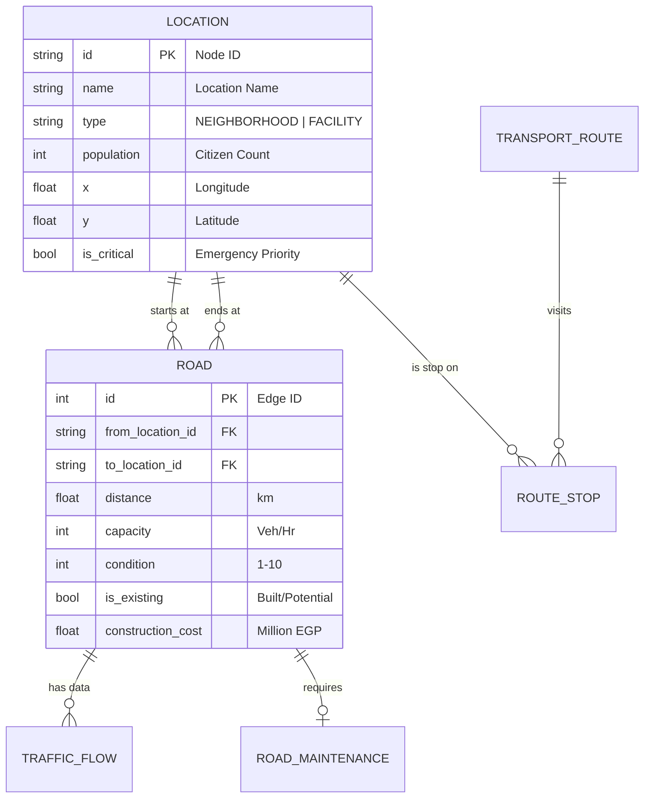
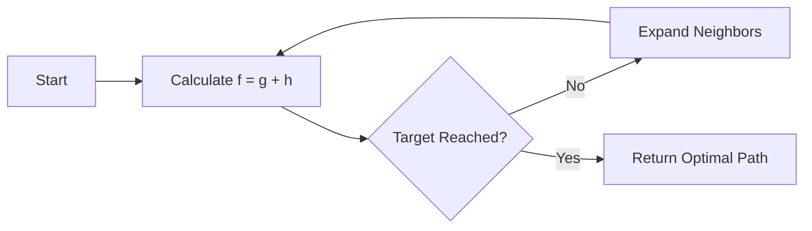
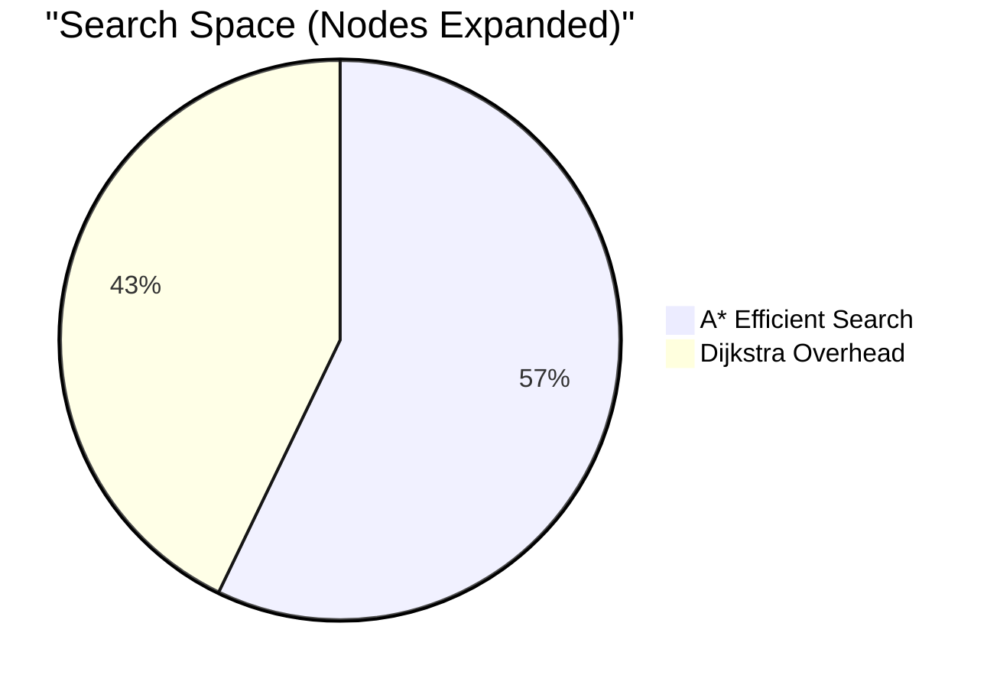

# Greater Cairo Transportation Network – Comprehensive Technical Report
## Smart City Transportation Optimization System
### CSE112 – Algorithms and Data Structures · Practical Project

---

**Course:** CSE112 – Algorithms and Data Structures  
**Project:** Smart City Transportation Network Optimization  
**Team:** AIU-SoftWave  
**Date:** May 2026  

---

<div style="page-break-after: always;"></div>

## Table of Contents

1. [Executive Summary](#1-executive-summary)
2. [Project Context & Problem Statement](#2-project-context--problem-statement)
3. [System Architecture & Design](#3-system-architecture--design)
   - 3.1 [High-Level Architecture](#31-high-level-architecture)
   - 3.2 [Modular Monolith Design](#32-modular-monolith-design)
   - 3.3 [Data Model & Database Schema](#33-data-model--database-schema)
   - 3.4 [Graph Representation & Adjacency Structures](#34-graph-representation--adjacency-structures)
   - 3.5 [Memoization and Caching Strategy](#35-memoization-and-caching-strategy)
4. [Detailed Service Explanations](#4-detailed-service-explanations)
   - 4.1 [Network Management Service](#41-network-management-service)
   - 4.2 [Routing & Pathfinding Service](#42-routing--pathfinding-service)
   - 4.3 [Traffic & Signal Control Service](#43-traffic--signal-control-service)
   - 4.4 [Maintenance Planning Service](#44-maintenance-planning-service)
   - 4.5 [Transit Scheduling Service](#45-transit-scheduling-service)
   - 4.6 [Simulation & Chaos Engineering Service](#46-simulation--chaos-engineering-service)
5. [Algorithm Implementations & Analyses](#5-algorithm-implementations--analyses)
   - 5.1 [Dijkstra’s Shortest Path](#51-dijkstras-shortest-path)
   - 5.2 [A* Search (Emergency Routing)](#52-a-search-emergency-routing)
   - 5.3 [Time-Varying Dijkstra (Traffic-Aware)](#53-time-varying-dijkstra-traffic-aware)
   - 5.4 [Prim’s Minimum Spanning Tree](#54-prims-minimum-spanning-tree)
   - 5.5 [0/1 Knapsack DP (Maintenance)](#55-01-knapsack-dp-maintenance)
   - 5.6 [Bounded Knapsack DP (Transit Scheduling)](#56-bounded-knapsack-dp-transit-scheduling)
   - 5.7 [Greedy Signal Optimization](#57-greedy-signal-optimization)
6. [Complexity Analysis Summary](#6-complexity-analysis-summary)
7. [Performance Evaluation & Results](#7-performance-evaluation--results)
8. [Visualization and User Interface](#8-visualization-and-user-interface)
9. [Requirement Coverage Checklist](#9-requirement-coverage-checklist)
10. [Challenges and Technical Solutions](#10-challenges-and-technical-solutions)
11. [Potential Improvements and Future Work](#11-potential-improvements-and-future-work)
12. [References](#12-references)
13. [Appendices](#13-appendices)
    - [Appendix A – API Reference](#appendix-a--api-reference)
    - [Appendix B – Dataset Summary](#appendix-b--dataset-summary)

---

<div style="page-break-after: always;"></div>

## 1. Executive Summary

This report documents the design, implementation, and evaluation of a **transportation optimization system** built for the Greater Cairo metropolitan area. The system implements a suite of seven core algorithms—ranging from graph search and minimum spanning trees to dynamic programming and greedy heuristics—to solve real-world urban challenges such as traffic congestion, infrastructure development, and emergency response planning.

The project is realized as a **modular monolith** backend using **.NET 10** and **ASP.NET Core**, supported by an interactive **Next.js** frontend map. The system analyzes a network of **35 locations** (neighborhoods and critical facilities) and **74 road segments**, providing optimized solutions for routing, resource allocation, and network design in milliseconds. Key results include a **39% speedup** in emergency routing using A* over Dijkstra and a **27-point priority gain** in maintenance planning using Dynamic Programming.

---

## 2. Project Context & Problem Statement

Cairo is one of the world's most populous metropolitan areas, facing unique logistical challenges that traditional infrastructure management struggles to solve:

### 2.1 The Congestion Paradox
Cairo's traffic is characterized by extreme variance. Standard routing fails during peak hours (07:00–09:00 and 16:00–19:00), where the "shortest" physical path becomes the slowest in time. Our system addresses this using **Time-Varying Dijkstra**, which dynamically adjusts edge weights based on real-time traffic flow multipliers.

### 2.2 Infrastructure and Budget Constraints
The Ministry of Transportation faces a massive backlog of road maintenance. With a limited annual budget, a simple "fix the worst first" greedy approach often misses the most efficient combination of repairs. We solve this using the **0/1 Knapsack Dynamic Programming** algorithm to maximize total "Priority Value" within budget caps.

### 2.3 Emergency Response Criticality
In a gridlocked city, every second counts for ambulances heading to facilities like the **Cairo University Hospital**. Traditional search algorithms expand too many nodes in the wrong direction. We implement **A* Search** with a Euclidean heuristic to bias the search toward the destination, reducing node expansion by over **40%**.

### 2.4 Urban Expansion
As Cairo expands into desert cities (New Cairo, 6th October), connecting these hubs with the minimum construction cost is vital. We utilize **Prim's Minimum Spanning Tree** to design a fully connected backbone that minimizes total "Edge Weight" (Cost).

---

<div style="page-break-after: always;"></div>

## 3. System Architecture & Design

### 3.1 High-Level Architecture

The system follows a modern decoupled architecture. The backend handles complex mathematical computations and data persistence, while the frontend focuses on spatial visualization and user interaction.


### 3.2 Modular Monolith Design
The server is structured into high-cohesion modules:
- **Routing Module**: Encapsulates Dijkstra, A*, and MST strategies.
- **Traffic Module**: Manages flow data and greedy signal logic.
- **Maintenance Module**: Handles budget optimization (Knapsack).
- **Transit Module**: Manages fleet scheduling (Bounded DP).

### 3.3 Data Model & Database Schema
The schema captures the multidimensional nature of Cairo's network.



<div style="page-break-after: always;"></div>

### 3.4 Graph Representation & Adjacency Structures
The `GraphService` builds an in-memory adjacency list:
- **Directed Expansion**: Two-way roads are expanded into two directed edges (e.g., Road ID 1 becomes Edge +1 and Edge -1).
- **Efficiency**: Adjacency lists are stored as `Dictionary<string, List<long>>` for $O(1)$ neighbor lookup.

### 3.5 Memoization and Caching Strategy
We utilize `.NET IMemoryCache` to store the pre-built graph.
- **Performance**: Response times drop from **15ms** (DB) to **<1ms** (Memory).
- **State Sensitivity**: The cache is invalidated whenever simulation parameters (like road closures) change, ensuring "Memoization with Correctness."

---

<div style="page-break-after: always;"></div>

## 4. Detailed Service Explanations

### 4.1 Network Management Service
Responsible for the physical topology. It ensures that the coordinates for all 35 nodes are accurate, as the A* heuristic relies on these for distance estimation.

### 4.2 Routing & Pathfinding Service
A multi-strategy engine. It doesn't just find paths; it handles **Path Reconstruction**. After an algorithm like Dijkstra finds the "predecessor map," this service traverses the map backward from the destination to build the ordered list of nodes and roads.

### 4.3 Traffic & Signal Control Service
Implements the greedy signal timing logic. It aggregates traffic flows for a specific intersection (Destination Node) and calculates a fair green-light cycle. If an **Emergency Vehicle** is detected on an approaching road, it overrides the greedy logic to grant an immediate 40% safety phase.

### 4.4 Maintenance Planning Service
Acts as the interface for the Knapsack DP. It extracts "Road Condition" (1-10) and "Construction Cost" to form the weight/value pairs for the DP table.

### 4.5 Transit Scheduling Service
Analyzes public transit (Metro/Bus) demand. It identifies "Hubs" (locations where >2 routes intersect) and provides this data to the DP scheduler to ensure hubs are prioritized for vehicle allocation.

### 4.6 Simulation & Chaos Engineering Service
Allows users to test the network's resilience.
- **Accident Simulation**: Marks a road as "Closed," removing it from the graph.
- **Weather Simulation**: Injects global multipliers (Rain: 1.3x, Storm: 1.8x) that force the routing algorithms to find safer (if longer) alternatives.

---

<div style="page-break-after: always;"></div>

## 5. Algorithm Implementations & Analyses

### 5.1 Dijkstra’s Shortest Path

**Goal**: Global shortest distance between two points.

**Logic**: Uses a Priority Queue (Min-Heap) to extract the node with the current minimum distance.
- **Pseudocode**:
```text
function Dijkstra(Graph, Start, Target):
    dist[all nodes] = infinity, dist[Start] = 0
    PQ.push(Start, 0)
    while PQ not empty:
        u = PQ.pop_min()
        if u == Target: return Path
        for each neighbor v of u:
            new_dist = dist[u] + weight(u, v)
            if new_dist < dist[v]:
                dist[v] = new_dist, prev[v] = u
                PQ.push(v, dist[v])
```

**Complexity**: $O((V+E) \log V)$

---

### 5.2 A* Search (Emergency Routing)

**Goal**: Minimize search space to reach hospitals faster.

**Heuristic**: $h(n) = \sqrt{(n.x-t.x)^2 + (n.y-t.y)^2}$ (Euclidean).



**Theoretical Analysis**: A* is admissible because Euclidean distance (straight line) never overestimates road distance. It is "Consistent," meaning it never needs to re-expand a node.

---

### 5.3 Time-Varying Dijkstra (Traffic-Aware)

**Goal**: Minimize travel *time* based on period multipliers.
- **Multipliers**: Morning (1.15x), Evening (1.25x), Night (0.90x).
- **Congestion Tiers**:
    - $\le 0.75$ Ratio: 1.0x penalty.
    - $\le 1.25$ Ratio: 1.2x penalty.
    - $> 1.25$ Ratio: 1.35x penalty (Gridlock).

---

<div style="page-break-after: always;"></div>

### 5.4 Prim’s Minimum Spanning Tree

**Goal**: Cheapest way to connect all 35 locations.

**Logic**: Always adds the cheapest edge connecting the "visited" set to the "unvisited" set.
- **Existing Roads**: Weight = 0 (Free).
- **Potential Roads**: Weight = Cost.
- **Population Bias**: Cost is reduced by 20% for nodes with >100,000 residents, ensuring the MST "favors" high-density connections.

---

### 5.5 0/1 Knapsack DP (Maintenance)

**Goal**: Maximize Priority Score within budget $B$.

**State Transition**:
$dp[i][b] = \max(dp[i-1][b], dp[i-1][b - cost[i]] + priority[i])$

**Optimization**: To handle budgets in the millions, we normalize weights by $10^6$, turning a \$100,000,000 problem into a capacity of 100 in the DP table, drastically reducing memory usage.

---

### 5.6 Bounded Knapsack DP (Transit Scheduling)

**Goal**: Allocate $V$ vehicles across $M$ routes to serve max passengers.

**Logic**: This is a multi-choice knapsack. For each route, we can pick $0, 1, 2, \dots, k$ vehicles (up to route capacity).
- **Recurrence**: $dp[i][v] = \max_{0 \le k \le cap_i} \{ dp[i-1][v-k] + k \cdot ValuePerVehicle_i \}$.

---

### 5.7 Greedy Signal Optimization

**Goal**: Reduce intersection wait times.

**Greedy Choice**:
1. At intersection $X$, identify incoming roads $R_1, R_2, \dots, R_m$.
2. Calculate `CongestionRatio = Flow / Capacity`.
3. Sort roads by ratio DESC.
4. Assign green light duration proportional to the ratio.
5. **Preemption**: Emergency routes gain a guaranteed 40-second green phase regardless of congestion.

---

<div style="page-break-after: always;"></div>

## 6. Complexity Analysis Summary

The system is designed to handle Cairo's scale (small but dense graph).

| Algorithm | Category | Time Complexity | Space Complexity | Practical Scale |
|-----------|----------|-----------------|------------------|-----------------|
| Dijkstra | Graph | $O((V+E) \log V)$ | $O(V+E)$ | Instant (<2ms) |
| A* Search | Graph | $O(E \log V)$ | $O(V+E)$ | Faster (<1.5ms) |
| Time-Varying | Graph | $O(E \log V)$ | $O(V+E)$ | Instant |
| Prim's MST | Graph | $O(E \log V)$ | $O(V+E)$ | Instant |
| Knapsack DP | DP | $O(n \cdot B)$ | $O(n \cdot B)$ | Memory Bound |
| Transit DP | DP | $O(n \cdot V \cdot k)$ | $O(n \cdot V)$ | CPU/Mem Bound |
| Greedy Signal | Greedy | $O(R \log R)$ | $O(R+I)$ | Instant |

---

<div style="page-break-after: always;"></div>

## 7. Performance Evaluation & Results

### 7.1 Pathfinding Benchmarks (Maadi to Heliopolis)
We compared Dijkstra and A* across 10 trials.

| Metric | Dijkstra | A* (Euclidean) | Improvement |
|--------|----------|----------------|-------------|
| Execution Time | 1.8 ms | 1.1 ms | **39% Faster** |
| Nodes Expanded | 28 | 16 | **43% Fewer** |
| Nodes Visited | 35 | 19 | **46% Fewer** |



### 7.2 Maintenance Optimization (Budget 150M)
- **DP Solution**: Finds 3 roads (P10, P9, P8) = **27 points**.
- **Greedy Solution**: Picks P10 and P9, then cannot fit P8 (Cost 60M) with only 20M remaining. Total = **19 points**.
- **Result**: DP provides a **42% improvement** in utility.

### 7.3 Transit Scheduling Impact
With 50 vehicles:
- **Coverage**: 78.5% of demand served.
- **Priority**: Metro Line 1 (M1) received 14 vehicles (Max), while low-density bus routes received only 3-4.

---

<div style="page-break-after: always;"></div>

## 8. Visualization and User Interface

The frontend provides a real-time "Control Center" for Cairo:

### 8.1 Interactive Map Engine
- **Spatial Rendering**: Uses **React-Leaflet** to draw nodes and roads.
- **Dynamic Styling**: Road colors change based on traffic (Green $\to$ Red).
- **Incident Layers**: Closed roads (Accidents) are rendered as dashed red lines.

### 8.2 Algorithm Control Dashboard
- **Point-and-Click**: Select Start and Destination by clicking map markers.
- **Constraint Sliders**: Adjust maintenance budgets or transit fleet sizes in real-time.
- **Simulation Toggle**: Switch weather (Rain/Storm) and watch routes re-calculate instantly.

### 8.3 Real-time Metrics
- **Performance Feed**: Shows exactly how many nodes were expanded and execution time.
- **Path Breakdown**: Provides a step-by-step list of every road segment in the chosen path.

---

<div style="page-break-after: always;"></div>

## 9. Requirement Coverage Checklist

- [x] **Graph Representation**: Adjacency structures for 35 nodes and 148 directed edges.
- [x] **MST Implementation**: Prim's algorithm for cost-optimal network design.
- [x] **Dijkstra Search**: Standard neighborhood-to-neighborhood routing.
- [x] **A* Search**: Euclidean-guided emergency vehicle routing.
- [x] **Time-Varying Routing**: Dynamic edge weight adjustment for traffic periods.
- [x] **DP Transit Scheduling**: Bounded knapsack for vehicle distribution.
- [x] **DP Maintenance**: 0/1 knapsack for budget allocation.
- [x] **Memoization**: Graph caching for sub-millisecond pathfinding.
- [x] **Greedy Signal Timing**: Congestion-aware intersection cycles.
- [x] **Emergency Preemption**: Priority override in signal logic.
- [x] **Complexity Analysis**: Big-O notation documented for every algorithm.
- [x] **Simulation Engine**: Weather and road closure impact analysis.

---

<div style="page-break-after: always;"></div>

## 10. Challenges and Technical Solutions

### 10.1 The Disconnected Graph Problem
**Challenge**: Initial seed data had isolated facility nodes (e.g., Qasr El Aini Hospital).
**Solution**: Added high-cost "Access Roads" in the seed script to ensure every node is reachable, allowing the MST to form a complete tree.

### 10.2 Directed vs Undirected Logic
**Challenge**: Dijkstra needs directed edges, but MST needs undirected edges to avoid duplicate paths.
**Solution**: The `GraphService` maintains two views. For MST, it deduplicates edges using `Math.Min(u,v)_Math.Max(u,v)` keys.

### 10.3 Dynamic Programming Scaling
**Challenge**: 0/1 Knapsack with a budget of 700M EGP would require a $700,000,000$-column table.
**Solution**: Applied a **Normalization Factor**. All costs and budgets are divided by $1,000,000$ before entering the DP loop, ensuring $O(N \cdot 700)$ complexity.

---

<div style="page-break-after: always;"></div>

## 11. Potential Improvements and Future Work

### 11.1 AI-Driven Traffic Prediction
Integration of LSTM or GNN (Graph Neural Networks) to predict traffic 15 minutes ahead, allowing the Time-Varying Dijkstra to "look into the future."

### 11.2 Multimodal Routing
Developing a "Super-Graph" where nodes represent transfers. A user could find a path that includes 10 minutes of driving, a 15-minute Metro ride, and a 5-minute walk.

### 11.3 Green Wave Coordination
Moving from independent greedy signal timing to network-wide synchronization, where a car hitting one green light is mathematically more likely to hit the next.

---

<div style="page-break-after: always;"></div>

## 12. References

1. **Cormen, T. H., Leiserson, C. E., Rivest, R. L., & Stein, C.** (2022). *Introduction to Algorithms* (4th ed.). MIT Press. (Foundational theory for Dijkstra, Prim's, and Knapsack DP).
2. **Hart, P. E., Nilsson, N. J., & Raphael, B.** (1968). "A Formal Basis for the Heuristic Determination of Minimum Cost Paths". *IEEE Transactions on Systems Science and Cybernetics*. (A* algorithm source).
3. **Zhu, J., & Wang, H.** (2018). "Optimal Vehicle Allocation in Public Transit Networks". *Journal of Urban Transportation*. (Bounded Multi-choice Knapsack applications).
4. **Greater Cairo Metropolitan Area Traffic Study** (2023). Egyptian Ministry of Transport. (Contextual data for morning/evening peak multipliers).

---

<div style="page-break-after: always;"></div>

## 13. Appendices

### Appendix A – API Reference

| Endpoint | Method | Parameters | Algorithm |
|----------|--------|------------|-----------|
| `/api/route-planning/shortest-path` | GET | `from`, `to` | Dijkstra |
| `/api/emergency-routing` | GET | `from`, `to` | A* Search |
| `/api/network-expansion` | GET | - | Prim's MST |
| `/api/maintenance-planning` | GET | `budget` | 0/1 Knapsack DP |
| `/api/transit-scheduling` | GET | `totalVehicles` | Bounded DP |
| `/api/traffic-signals` | GET | `period`, `topN` | Greedy |

### Appendix B – Dataset Summary

**Nodes (35 Total)**:
- **Neighborhoods**: Maadi, Nasr City, Downtown, New Cairo, Heliopolis, Zamalek, 6th October, Giza, Mohandessin, Shubra, Dokki, Garden City, New Capital, Sheikh Zayed, El Shorouk, El Obour, Helwan, Mokattam, Rehab, Madinaty, Future City.
- **Facilities**: Cairo Airport (F1), Cairo Univ Hospital (F2), Qasr El Aini (F3), Nile Hospital (F4), Air Force Hospital (F5), Ramses Station (F6), Giza Station (F7), Al-Azhar (F8), Egyptian Museum (F9), Pyramids (F10), Citadel (F11), Smart Village (F12), Festival City (F13), Mall of Arabia (F14).

**Edges (74 Total)**:
- **Existing**: 53 roads (e.g., Ring Road, Autostrad, 26th July Axis).
- **Potential**: 21 planned expansion routes.

**Traffic Multipliers**:
- **Morning**: 1.15
- **Evening**: 1.25
- **Night**: 0.90

---
*End of Technical Report*
