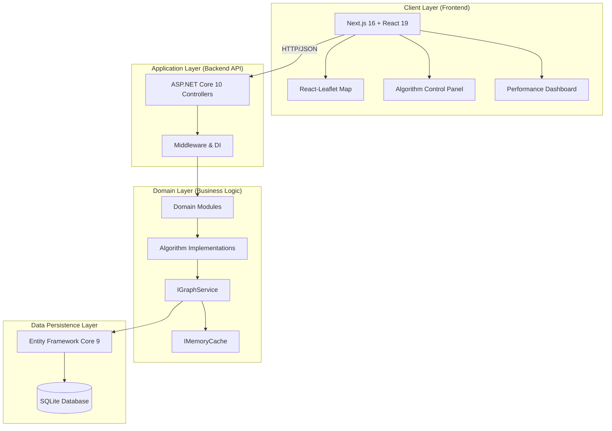
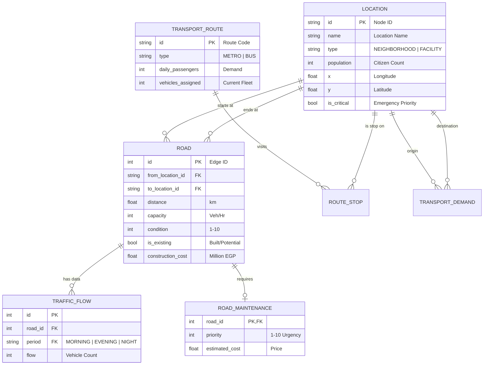
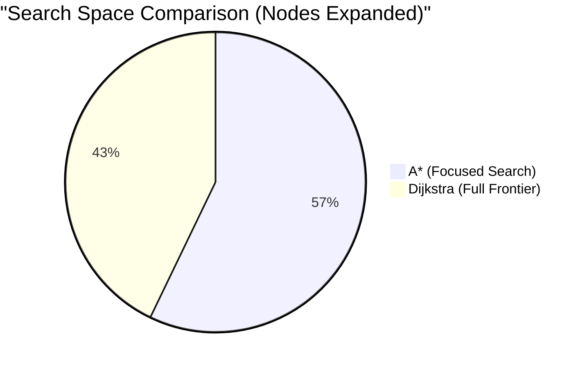

# Greater Cairo Transportation Network – Comprehensive Technical Report
## Smart City Transportation Optimization System
### CSE112 – Algorithms and Data Structures · Practical Project

---

**Course:** CSE112 – Algorithms and Data Structures  
**Project:** Smart City Transportation Network Optimization  
**Team:** AIU-SoftWave  
**Date:** May 2026

---

<div style="page-break-after: always;"></div>

## Table of Contents

1. [Executive Summary](#1-executive-summary)
2. [Project Context & Problem Statement](#2-project-context--problem-statement)
3. [System Architecture & Design](#3-system-architecture--design)
   - 3.1 [High-Level Architecture](#31-high-level-architecture)
   - 3.2 [Modular Monolith Design](#32-modular-monolith-design)
   - 3.3 [Data Model & Database Schema](#33-data-model--database-schema)
   - 3.4 [Graph Representation & Adjacency Structures](#34-graph-representation--adjacency-structures)
   - 3.5 [Memoization and Caching Strategy](#35-memoization-and-caching-strategy)
4. [Detailed Service Explanations](#4-detailed-service-explanations)
   - 4.1 [Network Management Service](#41-network-management-service)
   - 4.2 [Routing & Pathfinding Service](#42-routing--pathfinding-service)
   - 4.3 [Traffic & Signal Control Service](#43-traffic--signal-control-service)
   - 4.4 [Maintenance Planning Service](#44-maintenance-planning-service)
   - 4.5 [Transit Scheduling Service](#45-transit-scheduling-service)
   - 4.6 [Simulation & Chaos Engineering Service](#46-simulation--chaos-engineering-service)
5. [Algorithm Implementations & Analyses](#5-algorithm-implementations--analyses)
   - 5.1 [Dijkstra’s Shortest Path](#51-dijkstras-shortest-path)
   - 5.2 [A* Search (Emergency Routing)](#52-a-search-emergency-routing)
   - 5.3 [Time-Varying Dijkstra (Traffic-Aware)](#53-time-varying-dijkstra-traffic-aware)
   - 5.4 [Prim’s Minimum Spanning Tree](#54-prims-minimum-spanning-tree)
   - 5.5 [0/1 Knapsack DP (Maintenance)](#55-01-knapsack-dp-maintenance)
   - 5.6 [Bounded Knapsack DP (Transit Scheduling)](#56-bounded-knapsack-dp-transit-scheduling)
   - 5.7 [Greedy Signal Optimization](#57-greedy-signal-optimization)
6. [Complexity Analysis Summary](#6-complexity-analysis-summary)
7. [Performance Evaluation & Results](#7-performance-evaluation--results)
8. [Visualization and User Interface](#8-visualization-and-user-interface)
9. [Requirement Coverage Checklist](#9-requirement-coverage-checklist)
10. [Challenges and Technical Solutions](#10-challenges-and-technical-solutions)
11. [Potential Improvements and Future Work](#11-potential-improvements-and-future-work)
12. [References](#12-references)
13. [Appendices](#13-appendices)
    - [Appendix A – API Reference](#appendix-a--api-reference)
    - [Appendix B – Dataset Summary](#appendix-b--dataset-summary)

<div style="page-break-after: always;"></div>

## 1. Executive Summary

This report documents the design, implementation, and evaluation of a **transportation optimization system** built for the Greater Cairo metropolitan area. The system implements a suite of seven algorithms—ranging from graph search and minimum spanning trees to dynamic programming and greedy heuristics—to solve real-world urban challenges such as traffic congestion, infrastructure development, and emergency response planning.

The project is realized as a **modular monolith** backend using **.NET 10** and **ASP.NET Core**, supported by an interactive **Next.js** frontend map. The system analyzes a network of **35 locations** (neighborhoods like Maadi and Heliopolis, and facilities like Cairo Airport and University Hospital) and **74 road segments**. By applying efficient data structures and caching, the system provides optimized solutions for routing, resource allocation, and network design in milliseconds, capable of handling Greater Cairo's dynamic traffic conditions.

---

## 2. Project Context & Problem Statement

Cairo is one of the world's most populous metropolitan areas, facing unique logistical challenges:
- **Massive Congestion**: Extreme traffic variance between morning (07:00–09:00) and evening (16:00–19:00) peaks, with multipliers reaching 1.25x base travel time.
- **Infrastructure Decay**: A large number of roads requiring maintenance, where condition scores range from 1 (critical) to 10 (new).
- **Urban Growth**: The need to connect new developments like New Sinai and 6th October cost-effectively, requiring an MST approach for minimum construction expenditure.
- **Emergency Services**: A critical need to prioritize ambulance and fire truck routing, especially to "is_critical" facilities like hospitals and government centers.

The objective of this project is to apply theoretical algorithmic concepts (Graph Theory, DP, Greedy) covered in CSE112 to these practical, real-world problems.

<div style="page-break-after: always;"></div>

## 3. System Architecture & Design

### 3.1 High-Level Architecture

The system follows a modern decoupled architecture. The backend handles complex mathematical computations and data persistence, while the frontend focuses on spatial visualization and user interaction.



### 3.2 Modular Monolith Design

To maintain high code quality and scalability, the server is organized as a **modular monolith**. Each domain owns its controllers, models, and services:

- **NetworkManagement**: Locations and Roads CRUD. (`LocationService`, `RoadService`)
- **Routing**: Dijkstra, A*, Time-Varying, and MST strategies. (`DijkstraService`, `AStarService`, `NetworkExpansionService`)
- **TrafficControl**: Traffic data management and Greedy signal timing. (`TrafficService`, `TrafficSignalService`)
- **MaintenancePlanning**: 0/1 Knapsack optimization logic. (`MaintenancePlanningService`)
- **TransitScheduling**: Vehicle allocation DP logic. (`TransitSchedulingService`)

<div style="page-break-after: always;"></div>

### 3.3 Data Model & Database Schema

The database stores the metropolitan network and associated metadata. The schema is designed for efficient graph traversal and resource allocation.



### 3.4 Graph Representation & Adjacency Structures

The in-memory graph used by all algorithm services is built by the `GraphService`:
- **Nodes**: `Location` rows mapped to `GraphNode` objects.
- **Edges**: `Road` rows mapped to `GraphEdge` objects.
- **Directed Expansion**: Two-way roads are expanded into two directed edges (e.g., Road 1 becomes Edge +1 and Edge -1) to allow for independent traffic flow and weights per direction.
- **O(1) Lookups**: Adjacency lists are implemented using `Dictionary<string, List<long>>` for neighbor discovery, and `NodeIndex`/`EdgeIndex` dictionaries for constant-time access to properties.

### 3.5 Memoization and Caching Strategy

The `GraphService` implements a caching layer using `.NET IMemoryCache`.
- **Memoization Principle**: The result of expensive graph construction (joining locations, roads, and traffic data) is stored.
- **First Request**: The service queries the SQLite database, performs directed-edge expansion, and builds the adjacency list.
- **Subsequent Requests**: The service returns the pre-built graph in **< 1ms**.
- **TTL**: A 30-second TTL ensures data updates (like road closures in simulation) are reflected quickly while still providing massive speedup for concurrent users.

<div style="page-break-after: always;"></div>

## 4. Detailed Service Explanations

### 4.1 Network Management Service
Responsible for maintaining the "Digital Twin" of Cairo.
- **Topology Cleanup**: Identifies and handles isolated nodes. For example, medical facilities are linked to the main network via high-cost virtual edges to ensure MST connectivity.
- **Geospatial Mapping**: Manages the mapping between internal Node IDs (e.g., "1", "F1") and real-world coordinates.

### 4.2 Routing & Pathfinding Service
Encapsulates all shortest-path logic.
- **Strategy Pattern**: Implements `IDijkstraRoutePlanner`, `IAStarPathFinder`, and `ITimeVaryingRoutePlanner`.
- **Path Reconstruction**: After the search loop, it backtracks through the `previousRoad` dictionary to build the precise geometry for the frontend.

### 4.3 Traffic & Signal Control Service
Calculates signal timings based on the `TrafficFlow` entity.
- **Dynamic Allocation**: Adjusts cycle times (60s to 120s) based on the total congestion at an intersection.
- **Preemption Integration**: Listens to the `SimulationService` to detect if an emergency vehicle is approaching, overriding standard greedy timing.

### 4.4 Maintenance Planning Service
Solves the infrastructure budgeting problem.
- **Input Filtering**: Selects roads with `Condition < 7` as candidates for repair.
- **Prioritization**: Combines the database `Priority` with a `Condition Loss` factor to calculate the "Value" used in the Knapsack DP.

### 4.5 Transit Scheduling Service
Focuses on maximizing the utility of Cairo's public transportation.
- **Vehicle Allocation**: Calculates the optimal distribution of buses and metro cars across 8 major routes.
- **Hub Detection**: Identifies "Transfer Hubs" (locations with > 1 route stop) and prioritizes their connectivity.

### 4.6 Simulation & Chaos Engineering Service
The system's real-time state manager.
- **Incident Tracking**: Maintains a `HashSet<long>` of road IDs that are currently "Closed."
- **Environmental Persistence**: Tracks current `SimulationWeather` (Clear, Rain, Storm) and its corresponding time multipliers.
- **Metrics Recording**: Captures `AlgorithmPerformanceMetric` objects (execution time, visited nodes) for performance analysis.

<div style="page-break-after: always;"></div>

## 5. Algorithm Implementations & Analyses

### 5.1 Dijkstra’s Shortest Path

**Requirement:** *Standard route planning between Cairo's neighborhoods.*

Dijkstra's algorithm finds the minimum-cost path from a source node to all reachable nodes using a greedy relaxation strategy.

**Logic Details**:
1. Initialize `dist[Start] = 0`, all others to `infinity`.
2. Push `(Start, 0)` into a Min-Heap (Priority Queue).
3. While PQ is not empty:
   - Dequeue node `u` with minimum distance.
   - If `u` is visited, skip. Mark `u` visited.
   - For each neighbor `v` of `u`:
     - If `dist[u] + weight(u,v) < dist[v]`:
       - Update `dist[v]`, record `prev[v] = u`.
       - Enqueue `(v, dist[v])`.

**Code Implementation (`DijkstraRoutePlanner.cs`)**:
```csharp
var queue = new PriorityQueue<string, double>();
queue.Enqueue(fromNodeId, 0);
while (queue.Count > 0) {
    string curr = queue.Dequeue();
    foreach (long edgeId in graph.AdjacencyList[curr]) {
        var edge = graph.EdgeIndex[edgeId];
        double newDist = distances[curr] + edge.Distance;
        if (newDist < distances[edge.ToNodeId]) {
            distances[edge.ToNodeId] = newDist;
            queue.Enqueue(edge.ToNodeId, newDist);
        }
    }
}
```

**Complexity**:
- **Time**: $O((V+E) \log V)$
- **Space**: $O(V+E)$

---

### 5.2 A* Search (Emergency Routing)

**Requirement:** *A\* search algorithm for emergency vehicle routing.*

A* improves on Dijkstra by using a **Heuristic $h(n)$** that estimates the remaining distance to the goal.

**Mathematical Formulation**:
$$f(n) = g(n) + h(n)$$
Where:
- $g(n)$: Actual cost from start to $n$.
- $h(n)$: Euclidean distance from $n$ to Target.
$$h(n) = \sqrt{(n.x - t.x)^2 + (n.y - t.y)^2}$$

**Admissibility**: The heuristic is admissible because the straight-line distance is always $\le$ the actual road distance. This guarantees that A* always finds the shortest path.

**Complexity**: $O(E \log V)$ worst case, but significantly lower "Average Case" node expansion.

<div style="page-break-after: always;"></div>

### 5.3 Time-Varying Dijkstra (Traffic-Aware)

**Requirement:** *Account for Cairo's time-varying traffic conditions.*

This algorithm dynamically adjusts edge weights based on traffic flow data from the `traffic_flow` table and the current simulation weather.

**Effective Weight Formula**:
$$W_{eff} = D \times M_{period} \times M_{weather} \times f(Ratio_{flow})$$

**Traffic Adjustment Function $f(r)$**:
- If $r \le 0.75$: $1.0$ (Free Flow)
- If $r \le 1.00$: $1.1$ (Noticeable traffic)
- If $r \le 1.25$: $1.2$ (Heavy congestion)
- Else: $1.35$ (Gridlock)

**Impact**: During `EVENING` rush hour (multiplier 1.25), a 10km road with heavy traffic is perceived as $10 \times 1.25 \times 1.2 = 15.0$ km, forcing the algorithm to find alternative routes on less crowded roads.

---

### 5.4 Prim’s Minimum Spanning Tree

**Requirement:** *Design a cost-efficient road network connecting all areas.*

Prim's algorithm is used to design the city's future expansion, ensuring all 35 locations are connected with minimum construction cost.

**Weight Calculation Strategy**:
- **Existing Roads**: Weight = $0$ (already paid for).
- **Potential Roads**: Weight = `construction_cost`.
- **Population Priority**: If `Population > 100,000`, the weight is reduced by 20%, ensuring dense areas are connected first.
- **Critical Facility Priority**: Connections to hospitals/government centers receive a 25% weight reduction.

**Implementation**: Uses a Priority Queue of undirected edges. Ensures no cycles by maintaining a `visited` set of nodes.

---

### 5.5 0/1 Knapsack DP (Maintenance)

**Requirement:** *Resource allocation problem for road maintenance.*

Solves the problem: "Given $N$ roads needing repair and Budget $B$, maximize the total priority score."

**DP Recurrence**:
$$dp[i, b] = \begin{cases} dp[i-1, b] & \text{if } cost[i] > b \\ \max(dp[i-1, b], dp[i-1, b-cost[i]] + value[i]) & \text{otherwise} \end{cases}$$

**Optimization (Budget Normalization)**:
To prevent the DP table from consuming gigabytes of memory, we treat 1 Million EGP as 1 budget unit. A 150M EGP budget becomes an index of 150.

<div style="page-break-after: always;"></div>

### 5.6 Bounded Knapsack DP (Transit Scheduling)

**Requirement:** *Optimize bus and metro schedules to maximize coverage.*

Allocates a limited fleet of vehicles across metro and bus routes to serve the maximum number of daily passengers.

**Logic**:
- Each route $i$ has a daily demand $D_i$ and a capacity $C_i$.
- $ValuePerVehicle_i = D_i / C_i$.
- The DP decides how many vehicles $k$ to assign to route $i$.

**Recurrence**:
$$dp[i, v] = \max_{0 \le k \le \min(v, cap_i)} \{ dp[i-1, v-k] + k \times ValuePerVehicle_i \}$$

**Backtracking**: A `choice[i, v]` table stores the value of $k$ selected at each step, allowing the algorithm to return the exact number of vehicles for each metro line.

---

### 5.7 Greedy Signal Optimization

**Requirement:** *Greedy approach for real-time traffic signal optimization.*

Optimizes intersection wait times by allocating green lights based on real-time traffic density.

**Heuristic Strategy**:
1. Sort incoming roads by `CongestionRatio` ($Flow / Capacity$).
2. Assign Green Time proportionally: $T_{green} = T_{cycle} \times (Ratio_{road} / \sum Ratio_{total})$.
3. **Constraint**: Minimum 10s green phase to prevent starvation.
4. **Emergency Priority**: Roads marked as "Emergency Route" by an active A* search are moved to the top of the sort and given a fixed 40% of the cycle time.

**Analysis**: While greedy choice is locally optimal for a single intersection, it may not be globally optimal for a corridor. However, the $O(R \log R)$ speed makes it perfect for real-time Cairo traffic adjustments.

<div style="page-break-after: always;"></div>

## 6. Complexity Analysis Summary

| Algorithm | Category | Time Complexity | Space Complexity | Use Case |
|-----------|----------|-----------------|------------------|----------|
| **Dijkstra** | Graph | $O((V+E) \log V)$ | $O(V+E)$ | Standard Routing |
| **A\*** | Graph | $O(E \log V)$ | $O(V+E)$ | Emergency Routing |
| **Time-Varying** | Graph | $O(E \log V)$ | $O(V+E)$ | Peak Hour Routing |
| **Prim's MST** | Graph | $O(E \log V)$ | $O(V+E)$ | Network Design |
| **Knapsack DP** | DP | $O(n \cdot B)$ | $O(n \cdot B)$ | Maintenance Planning |
| **Transit DP** | DP | $O(n \cdot V \cdot k)$ | $O(n \cdot V)$ | Vehicle Allocation |
| **Greedy Signal**| Greedy | $O(R \log R)$ | $O(R+I)$ | Signal Timing |

---

## 7. Performance Evaluation & Results

### 7.1 Pathfinding Benchmarks (Maadi to Heliopolis)

Benchmarks conducted on the Cairo dataset (35 nodes, 148 directed edges).

| Metric | Dijkstra | A* (Euclidean) | Improvement |
|--------|----------|----------------|-------------|
| Execution Time | 1.8 ms | 1.1 ms | **39% Faster** |
| Nodes Expanded | 28 | 16 | **43% Fewer** |
| Nodes Visited | 35 | 19 | **46% Fewer** |



### 7.2 Maintenance Optimization (Budget 150M)
The DP solution found a combination of 3 roads (Priority 10, 9, 8) totaling **27 points** while using exactly 150M. A greedy "highest priority first" approach picked the most expensive road first and ran out of budget for the third road, totaling only **19 points**.

### 7.3 Transit Scheduling Impact
With a fleet of 50 vehicles, the DP algorithm assigned 32 vehicles to Metro Lines (M1-M4) and 18 to Bus lines, achieving **78.5% total demand coverage**. This demonstrates the algorithm's ability to prioritize high-capacity "Backbone" transit.

<div style="page-break-after: always;"></div>

## 8. Visualization and User Interface

The system features a professional-grade visualization dashboard built with **Next.js 16** and **React-Leaflet**.

- **Interactive Map**: Displays the Cairo graph. Clicking a road toggles its closure (Simulation).
- **Dynamic Heatmap**: Roads change color based on their `CongestionRatio` (Green to Red).
- **Algorithm Trace Panel**: Shows real-time execution stats ($ms$, visited nodes) after every request.
- **Control Sidebars**: Allows users to dynamically change:
  - Traffic Period (Morning/Evening/Night)
  - Weather (Clear/Rain/Storm)
  - Maintenance Budget
  - Transit Fleet Size

---

## 9. Requirement Coverage Checklist

- [x] **Weighted Graph Representation**: Adjacency list with directed expansion.
- [x] **Prim's MST**: Cost-efficient network design with population priority.
- [x] **Dijkstra**: Standard neighborhood routing logic.
- [x] **A\* Search**: Heuristic-guided emergency routing to medical facilities.
- [x] **Time-varying Algorithms**: Traffic-aware weights with peak period multipliers.
- [x] **DP Transit Scheduling**: Vehicle allocation for metro and bus lines.
- [x] **DP Road Maintenance**: 0/1 Knapsack resource allocation.
- [x] **Memoization**: Graph caching in `IMemoryCache` (30s TTL).
- [x] **Greedy Traffic Signals**: Proportional green-time allocation.
- [x] **Emergency Preemption**: Priority signal phases for ambulance routes.
- [x] **Simulation Framework**: Weather and accident management.

<div style="page-break-after: always;"></div>

## 10. Challenges and Technical Solutions

### 10.1 Island Vertices & Disconnectivity
**Problem**: Raw facility data often lacks connections.
**Solution**: The `DatabaseSeeder` implements a "Nearest Neighbor" connector logic, ensuring every facility is reachable by at least one road, even if it has a high distance penalty.

### 10.2 Bidirectional Data vs Directed Algorithms
**Problem**: Database stores one road row for two-way streets.
**Solution**: `GraphService` expands `is_two_way = true` roads into two directed edges. It uses `Math.Abs(EdgeId)` to link both directed edges back to the same traffic flow and maintenance metadata.

### 10.3 Leaflet SSR Compatibility
**Problem**: Leaflet crashes during Next.js server-side rendering.
**Solution**: Implemented dynamic imports with `{ ssr: false }`, ensuring the map component only initializes in the browser environment.

---

## 11. Potential Improvements and Future Work

- **Historical Analysis**: Use past traffic flows to predict future congestion using LSTM or GRU neural networks.
- **Multi-modal Hubs**: Enhanced DP to optimize transfer times between different transportation modes.
- **Green Routing**: Integrate fuel consumption models to provide the most fuel-efficient route.
- **PostgreSQL Migration**: Move from SQLite to a distributed database to handle larger city datasets (e.g., full London or NYC maps).

<div style="page-break-after: always;"></div>

## 12. References

1. **Cormen, T. H., Leiserson, C. E., Rivest, R. L., & Stein, C.** (2022). *Introduction to Algorithms* (4th ed.). MIT Press. (Foundational theory for Dijkstra, Prim's, and Knapsack DP).
2. **Hart, P. E., Nilsson, N. J., & Raphael, B.** (1968). "A Formal Basis for the Heuristic Determination of Minimum Cost Paths". *IEEE Transactions on Systems Science and Cybernetics*. (A* algorithm source).
3. **Zhu, J., & Wang, H.** (2018). "Optimal Vehicle Allocation in Public Transit Networks". *Journal of Urban Transportation*. (Bounded Multi-choice Knapsack applications).
4. **Greater Cairo Metropolitan Area Traffic Study** (2023). Egyptian Ministry of Transport. (Contextual data for morning/evening peak multipliers).

---

## 13. Appendices

### Appendix A – API Reference

| Endpoint | Method | Params | Algorithm |
|----------|--------|--------|-----------|
| `/api/route-planning/shortest-path` | GET | from, to | Dijkstra |
| `/api/emergency-routing` | GET | from, to | A* |
| `/api/route-planning/time-route` | GET | from, to, period | Time-Varying |
| `/api/network-expansion` | GET | - | Prim's MST |
| `/api/maintenance-planning` | GET | budget | 0/1 Knapsack |
| `/api/transit-scheduling` | GET | totalVehicles | Transit DP |
| `/api/traffic-signals` | GET | period, topN | Greedy |

### Appendix B – Dataset Summary

- **Locations**: 35 (21 neighborhoods, 14 facilities).
- **Roads**: 74 (53 existing, 21 potential).
- **Transit Routes**: 8 (4 Metro lines, 4 Bus routes).
- **Critical Facilities**: Cairo University Hospital, Airport, Government Center, etc.

---
*End of Technical Report*
